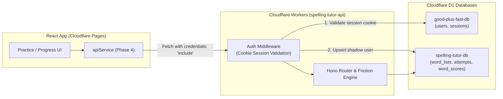

# Backend API & D1 Database Architecture

This document describes the backend design, authentication handshake, and database schema for the Spelling Tutor app.

---

## Architecture & Data Flow

---

## Database Schema (`spelling-tutor-db`)

### `users` (Shadow User Table)
*Mirrors authenticated accounts from `good-plus-fast-db` to allow local relational integrity without cross-database joins.*
- `id` (TEXT, PK): Matches `users.id` in `good-plus-fast-db`
- `email` (TEXT)
- `created_at` (DATETIME)

### `word_lists`
*Stores user-created or imported custom spelling lists.*
- `id` (TEXT, PK): UUID
- `user_id` (TEXT, FK -> `users.id` ON DELETE CASCADE)
- `name` (TEXT): Name of the spelling list (e.g. "Week 4 — Prefixes")
- `words_raw` (TEXT): Hyphenated syllable text lines (e.g. `con-trol\npro-ject`)
- `is_default` (INTEGER): `1` if this is currently the active list, `0` otherwise
- `created_at` (DATETIME)
- `updated_at` (DATETIME)

### `attempts`
*Granular per-letter practice history for every practice exercise.*
- `id` (TEXT, PK): UUID
- `user_id` (TEXT, FK -> `users.id` ON DELETE CASCADE)
- `word` (TEXT): The full target word
- `letter` (TEXT): The letter tested
- `position` (INTEGER): Zero-indexed position of letter in word
- `correct` (INTEGER): `1` if correct, `0` if mistake
- `practiced_at` (DATETIME)

### `word_scores`
*Aggregated struggle metrics per word per user, updated automatically on batch practice submission.*
- `id` (TEXT, PK): UUID
- `user_id` (TEXT, FK -> `users.id` ON DELETE CASCADE)
- `word` (TEXT)
- `attempt_count` (INTEGER)
- `error_count` (INTEGER)
- `friction_score` (INTEGER): Exponential consecutive error penalty score
- `ai_suggestion` (TEXT, nullable): Cached JSON memory trick generated by Cloudflare Workers AI
- `last_practiced` (DATETIME)
- Constraint: `UNIQUE(user_id, word)`

---

## API Endpoints (`spelling-tutor-api`)

| Method | Path | Auth Required | Description |
|---|---|---|---|
| `GET` | `/api/spelling/health` | No | Worker health status and phase |
| `GET` | `/api/spelling/lists` | Yes | Get all saved word lists for authenticated user |
| `POST` | `/api/spelling/lists` | Yes | Create or update a custom word list |
| `DELETE` | `/api/spelling/lists/:id` | Yes | Delete a custom word list by ID |
| `POST` | `/api/spelling/attempts` | Yes | Submit batch of practice attempts; recalculates friction scores |
| `GET` | `/api/spelling/scores` | Yes | List all word struggle scores |
| `GET` | `/api/spelling/scores/hardest` | Yes | Top N hardest words (`friction_score > 0`) |
