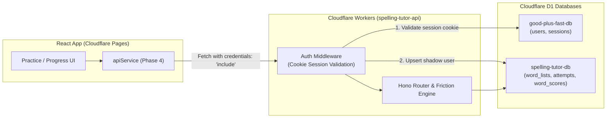

# Backend API & D1 Database Architecture

This document describes the backend design, authentication handshake, and database schema for the Spelling Tutor app.

---

## Architecture & Data Flow

```mermaid
flowchart LR
    subgraph Frontend["React App (Cloudflare Pages)"]
        UI["Practice / Progress UI"]
        SVC["apiService (Phase 4)"]
    end

    subgraph Edge["Cloudflare Workers (spelling-tutor-api)"]
        AUTH["Auth Middleware\n(Cookie Session Validation)"]
        HONO["Hono Router & Friction Engine"]
    end

    subgraph Storage["Cloudflare D1 Databases"]
        GPF["good-plus-fast-db\n(users, sessions)"]
        SPELL["spelling-tutor-db\n(word_lists, attempts, word_scores)"]
    end

    UI --> SVC
    SVC -->|"Fetch with credentials: 'include'"| AUTH
    AUTH -->|"1. Validate session cookie"| GPF
    AUTH -->|"2. Upsert shadow user"| SPELL
    AUTH --> HONO
    HONO --> SPELL
```

---

## Database Schema (`spelling-tutor-db`)

### `users` (Shadow User Table)
*Mirrors authenticated accounts from `good-plus-fast-db` to allow local relational integrity without cross-database joins.*
- `id` (TEXT, PK): Matches `users.id` in `good-plus-fast-db`
- `email` (TEXT)
- `created_at` (DATETIME)

### `word_lists`
*Stores user-created or imported custom spelling lists.*
- `id` (TEXT, PK): UUID
- `user_id` (TEXT, FK -> `users.id` ON DELETE CASCADE)
- `name` (TEXT): Name of the spelling list (e.g. "Week 4 — Prefixes")
- `words_raw` (TEXT): Hyphenated syllable text lines (e.g. `con-trol\npro-ject`)
- `is_default` (INTEGER): `1` if this is currently the active list, `0` otherwise
- `created_at` (DATETIME)
- `updated_at` (DATETIME)

### `attempts`
*Granular per-letter practice history for every practice exercise.*
- `id` (TEXT, PK): UUID
- `user_id` (TEXT, FK -> `users.id` ON DELETE CASCADE)
- `word` (TEXT): The full target word
- `letter` (TEXT): The letter tested
- `position` (INTEGER): Zero-indexed position of letter in word
- `correct` (INTEGER): `1` if correct, `0` if mistake
- `practiced_at` (DATETIME)
- `client_id` (TEXT, nullable): client-generated id; partial unique index `(user_id, client_id)` makes retried batches idempotent (migration `0002`)
- `session_id` (TEXT, nullable): one visit to a list; scoring counts the last answer per letter per session (migration `0003`)
- `typed` (TEXT, nullable): the letter the child actually entered (for reversals) (migration `0003`)
- `learner_id` (TEXT): equals `user_id` until family accounts (migration `0003`)

### `word_scores`
*Aggregated struggle metrics per word per user, updated automatically on batch practice submission.*
- `id` (TEXT, PK): UUID
- `user_id` (TEXT, FK -> `users.id` ON DELETE CASCADE)
- `word` (TEXT)
- `attempt_count` (INTEGER)
- `error_count` (INTEGER)
- `friction_score` (INTEGER): Exponential consecutive error penalty score
- `ai_suggestion` (TEXT, nullable): Cached JSON memory trick generated by Cloudflare Workers AI
- `perfect_streak` (INTEGER): consecutive perfect sessions (migration `0003`)
- `mastered_at` (DATETIME, nullable): attempts before this no longer count toward friction (migration `0003`)
- `last_practiced` (DATETIME)
- Constraint: `UNIQUE(user_id, word)`

### `practice_sessions` / `pattern_stats` (migration `0003`)
See [`05_ai_engine.md`](./05_ai_engine.md). `practice_sessions(id, learner_id, list_id, started_at, last_seen_at)`; `pattern_stats(learner_id, pattern, attempts, misses, distinct_words, sessions_missed, missed_words_json, status, first_qualified_at, cleared_at, report_json, report_generated_at, updated_at)` keyed by `(learner_id, pattern)`.

### `weekly_digests` / `digest_prefs` (migration `0004`)
`weekly_digests(learner_id, week_start, digest_json, created_at)`, primary key `(learner_id, week_start)`: one digest per learner per 7-day period. `digest_prefs(user_id, email_opt_in, unsubscribe_token, updated_at)`: the weekly-email opt-in (default off) and the token used by the unsubscribe link.

---

## API Endpoints (`spelling-tutor-api`)

| Method | Path | Auth Required | Description |
|---|---|---|---|
| `GET` | `/api/spelling/health` | No | Worker health status and phase |
| `GET` | `/api/spelling/lists` | Yes | Get all saved word lists for authenticated user |
| `GET` | `/api/spelling/lists/:id` | Yes | One list (owner only; anyone else gets 404) |
| `POST` | `/api/spelling/lists` | Yes | Create a list (optional client UUID `id`) |
| `PUT` | `/api/spelling/lists/:id` | Yes | Upsert with a client-generated UUID; 409 at 25 lists |
| `DELETE` | `/api/spelling/lists/:id` | Yes | Delete a custom word list by ID |
| `POST` | `/api/spelling/attempts` | Yes | Submit up to 500 attempts (`client_id` for idempotency); returns `{ recorded, duplicates, words_updated }` |
| `GET` | `/api/spelling/scores` | Yes | List all word struggle scores |
| `GET` | `/api/spelling/scores/hardest` | Yes | Top N hardest words (`friction_score > 0`) |
| `GET` | `/api/spelling/patterns` | Yes | Learner's spelling patterns with label, status, examples and cached report |
| `POST` | `/api/spelling/scores/:word/analyze` | Yes | Kid tip for a tricky word (Phase 5b) |
| `POST` | `/api/spelling/patterns/:pattern/analyze` | Yes | Parent report for an active pattern (Phase 5b) |
| `GET` | `/api/spelling/scores/:word` | Yes | One word: score, per-letter results, tip (Phase 5c) |
| `GET` | `/api/spelling/digest/latest` | Yes | Newest weekly digest (Phase 5c) |
| `GET` / `PUT` | `/api/spelling/digest/prefs` | Yes | Weekly email opt-in (Phase 5c) |
| `GET` | `/api/spelling/digest/unsubscribe` | No (token) | Unsubscribe link from the email (Phase 5c) |
