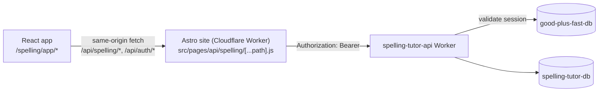

# Auth, URLs & Data Sync (Phase 4)

How the app knows who the user is, how word lists and practice history reach the cloud, and how every screen and list gets its own URL.

---

## 1. Request path (why there is a proxy)

The `session` cookie is `HttpOnly`, `SameSite=Lax` and belongs to `goodplusfast.com`; the API Worker lives on `*.workers.dev`, so browsers never send the cookie to it. Same pattern as Flashy Cards:

* The Astro route reads the cookie and forwards it as a Bearer token; the Worker prefix `/api/spelling` is kept.
* `apiService.js` uses relative URLs. Set `VITE_API_ORIGIN` for builds served from another origin (Capacitor, Phase 7).
* Dev: `vite.config.js` proxies `/api` to the local Astro site (`localhost:4321`).

**Running the Astro site locally:** use a plain `npm run dev` in `jerome-portfolio`. Its `astro.config.mjs` defaults to the `@astrojs/cloudflare` adapter with `platformProxy` enabled, which is what wires up `locals.runtime.env.good_plus_fast_db` against the local D1 sqlite file in `.wrangler/state/v3/d1/`. Do **not** set `ADAPTER=node` for this — that swaps in `@astrojs/node`, which has no Cloudflare bindings at all, and every `/api/auth/*` route will 500 with "Database binding not found" (there's no D1, no `locals.runtime`, nothing — `import.meta.env` doesn't have it either). If you ever see that error locally, check for a stale `ADAPTER` env var in the shell or a leftover dev server still bound to port 4321 from an earlier run. `tools/01.launch_dev.bat` runs this correctly.

**`/admin/ai-credits` will 500 locally** (`fetch failed` / `ECONNREFUSED` on `/api/fc/admin/ai-status`) because it also calls the Flashy Cards worker, which `01.launch_dev.bat` does not start — getting that worker's `good_plus_fast_db` binding to see the same local users/sessions/AI-quota data as the Astro site (they default to separate local D1 files per project) turned out more trouble than it was worth for a page only the admin account uses. Test `/admin/ai-credits` on production instead.

## 2. Auth state (`useAuth.jsx`)

`status`: `loading` → `anonymous | authenticated | expired`. Checked via `GET /api/auth/me` on load, on window focus and on tab visibility (so logging in or out in another tab is picked up). `authenticated → not authenticated` becomes `expired` (UI says "Log in again"; local data is untouched). Offline or server errors never log the user out.

Login links go to `/login?redirect=<current path+query+hash>`. The main site validates the target with `safeRedirect()` (same-site paths only) for password login, Google OAuth (`login_redirect` cookie) and the login/signup toggle, so users return to the exact URL they left. Email-verification links for new accounts do not carry the redirect.

## 3. URL scheme (relative to `/spelling/app`)

| URL | Screen |
|---|---|
| `/` | Redirects to the last-used list |
| `/lists` | All lists |
| `/lists/default` | Built-in default list (virtual, never synced until edited) |
| `/lists/:listId` | Practice one list — `listId` is a client-generated UUID that is also the server primary key |
| `/progress` | Progress dashboard (`?list=<id>` filters) |
| `/progress/words/:word` | One word: letter-by-letter results and its tip (Phase 5c) |

* URLs are addresses, not credentials. The API scopes every query by `user_id`; another user's id returns 404, identical to a non-existent list. Lists that exist only in one anonymous browser resolve only there.
* Deep links need SPA fallback: `public/_redirects` (`/* /index.html 200`). The proxy Worker forwards any `/spelling/app*` path and strips the prefix.
* `main.jsx` mounts `BrowserRouter` with `basename` from `import.meta.env.BASE_URL`.

## 4. Local-first list sync

The UI reads and writes `localStorage` (`spelling_tutor_lists_v5`); sync runs in the background (`useLists.jsx` → `syncService.js`).

List: `{ id, name, wordsRaw, isDefault, updatedAt, dirty, deleted, focusGroups, hints }` (the last two are smart hiding; synced as `focus_groups` / `hints`). Editing the virtual default creates a real list.

`mergeLists(local, remote)` (pure, tested):

| Situation | Result |
|---|---|
| Remote only | Add locally |
| Local tombstone (`deleted`) | `DELETE` remotely |
| Both, local `dirty` and newer | `PUT /lists/:id` (upsert) |
| Both, otherwise | Remote wins |
| Local only, dirty (created offline / before first login) | `PUT` |
| Local only, clean | Deleted on another device — drop locally |

`reconcile()` folds the result into the *current* state so edits made while requests were in flight are never lost. Conflict policy is **last-write-wins per list**; the server `updated_at` is authoritative after a push.

Triggers: becoming authenticated, 1.5 s after a local edit, every 30 s while anything is pending, `online`, manual refresh. Failures set `syncStatus` (`offline | error | partial`); a 401 flips auth to `expired`. Limits: 25 lists per user, 20 KB per list (server enforces; UI shows a message).

Legacy storage (`spelling_tutor_words_v4/v3/v2`) migrates once into a dirty list named "My Words" (unless it is a copy of the default).

## 5. Practice attempts (`attemptQueue.js`)

* `WordCard.handleVerify` reports one attempt per checked hidden letter: `{ letter, position (global index), correct }` for `word.word` (never the phonetic override text). Retrying after a miss records again — that is the "consecutive misses" signal the friction score uses.
* Attempts are always queued locally (`spelling_tutor_attempt_queue_v1`, cap 1000 — oldest dropped) and each gets a `client_id`.
* When authenticated the queue is flushed to `POST /api/spelling/attempts` in chunks of 400 (server max 500). A retried batch is harmless: the API does `INSERT OR IGNORE` against the partial unique index `(user_id, client_id)` (migration `0002`), so scores are never double-counted.
* Chunk acknowledged → removed. Offline/401 → kept. 400 → dropped (a bad row must not block the queue). On page hide the queue is flushed with `keepalive`.
* Anonymous attempts stay queued and upload on first login.

## 6. Progress page

Flushes the queue, then loads scores, patterns and the latest weekly digest in parallel (patterns and the digest are extras: if either fails the word progress still shows). Shows the weekly summary and email opt-in, stat tiles, the Mastered / Struggling / Needs-practice buckets, the spelling patterns list with parent reports, and a table of all words sorted by friction score. Empty, loading, offline, expired and error states are handled. Flames on the practice page open an AI tip (see `05_ai_engine.md`).

## 7. Failure modes

| Failure | Behaviour |
|---|---|
| Session expires mid-practice | Banner + "Log in again"; work stays local and dirty; syncs after re-login |
| Offline | Practice continues; `Offline — will sync later`; retries on `online`/30 s |
| Storage unavailable | All storage calls are guarded; app works in memory |
| List over limit / too large | Kept locally, `Some lists not saved` |
| Shared device: user B logs in | Clean (previously synced) lists from A vanish because they are not in B's account; unsynced local lists would upload to B |
