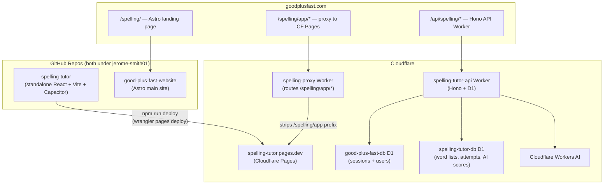

# Spelling Tutor — Action Plan
> Skill: `creating-new-features` | Repo: `jerome-smith01/spelling`

---

## Overall Status

| Phase | Title | Status | Model | Tool | Depends On |
|-------|-------|--------|-------|------|------------|
| 0 | Infrastructure & Repo Setup | ✅ Complete | Gemini 3.8 Flash | Antigravity | None |
| 1 | Standalone React App (Vite + PWA shell) | 🔲 Not Started | Gemini 3.8 Flash | Antigravity | Phase 0 |
| 2 | Core Spelling Features (all 7 from spec) | 🔲 Not Started | Gemini 3.8 Flash | Antigravity | Phase 1 |
| 3 | Cloudflare Backend API + D1 Schema | 🔲 Not Started | Gemini 3.8 Flash | Antigravity | Phase 0 |
| 4 | Auth Integration + User Data Sync | 🔲 Not Started | Gemini 3.8 Flash | Antigravity | Phase 2, 3 |
| 5 | AI Struggling-Areas Engine (Global Quota) | 🔲 Not Started | Gemini 3.8 Flash | Antigravity | Phase 4 |
| 6 | Astro Landing Page + Proxy Worker | 🔲 Not Started | Gemini 3.8 Flash | Antigravity | Phase 1 |
| 7 | Android (Capacitor) | 🔲 Not Started | Gemini 3.8 Flash | Antigravity | Phase 2 |
| 8 | Apps Hub + Docs | 🔲 Not Started | Gemini 3.8 Flash | Antigravity | Phase 6 |

---

## Architecture Overview



### Key Architecture Decisions (all resolved)

| Decision | Choice | Reason |
|---|---|---|
| URL slug | `/spelling` | User confirmed |
| Repo strategy | Standalone repo | Independent deployment needed |
| Frontend stack | Vite + React | PWA + Capacitor (Android) compatible |
| Auth system | Existing GPF session cookie + `good_plus_fast_db` | Same pattern as Flashy Cards — zero new auth infrastructure |
| Backend | Hono on Cloudflare Workers + D1 | Same stack as Flashy Cards; Workers AI already available |
| Database | New `spelling-tutor-db` D1 | Separate from main site DB; joins to `good_plus_fast_db` for auth |
| Cloudflare vs Supabase | Cloudflare | Supabase is PTB's legacy; new apps use GPF unified auth |
| PWA | `vite-plugin-pwa` | Free PWA capability from the same Vite build |
| Android | Capacitor | Wraps the React web app — same codebase, same Web Speech API |
| Deployment | Own CF Pages project + proxy Worker | Like PTB but React instead of Flutter |
| Phase 1 persistence | LocalStorage | DB wired in Phase 4 |

---

## Open Questions (for you to answer before each phase)

> [!IMPORTANT]
> **Before Phase 0:** Please create the GitHub repo at `jerome-smith01/spelling-tutor` (you already had the create page open). Leave it empty — I will push the first commit. Confirm when done.

> [!IMPORTANT]
> **Before Phase 3:** Confirm whether to create a brand-new Cloudflare D1 database named `spelling-tutor-db`, or if you'd prefer a different name. I'll provide the exact `wrangler` command to run.

> [!IMPORTANT]
> **Before Phase 5:** The AI engine will use Cloudflare Workers AI (same as Flashy Cards' Leech Hunter). Do you want the same daily neuron cap and kill-switch pattern, or a different limit for the spelling app?

> [!NOTE]
> **Android (Phase 7):** Capacitor requires Android Studio installed. Confirm you have it when we reach that phase.

---

## Phase 0 — Infrastructure & Repo Setup

**Goal:** Create the Git repo, establish the file structure, connect to Cloudflare, and wire up the proxy so future phases have a deploy target from day one.

**Model:** `Claude Sonnet (Low effort)` — Antigravity
*Reason: Mechanical file/config creation with known patterns; no logic complexity.*

### File-Level Changes

| Action | File | Notes |
|--------|------|-------|
| NEW | `spelling_tutor/.gitignore` | Node + Vite standard |
| NEW | `spelling_tutor/README.md` | Project overview linking to spec, docs, and live URL |
| NEW | `spelling_tutor/package.json` | Vite + React + vite-plugin-pwa + Capacitor |
| NEW | `spelling_tutor/vite.config.js` | base: `/spelling/app/`, PWA plugin |
| NEW | `spelling_tutor/index.html` | React mount point |
| NEW | `spelling_tutor/src/main.jsx` | React root |
| NEW | `spelling_tutor/src/App.jsx` | Placeholder "coming soon" shell |
| NEW | `spelling_tutor/public/manifest.json` | PWA manifest |
| NEW | `spelling_tutor/tools/01.launch_dev.bat` | Starts Vite dev server locally |
| NEW | `spelling_tutor/tools/02.build_web.bat` | Clean Vite production build |
| NEW | `spelling_tutor/tools/03.publish_web_to_cloudflare.bat` | Builds, deploys to CF Pages, and purges CDN cache |
| NEW | `spelling_tutor/tools/04.arch_review.bat` | Inspects recent changes against architecture docs |
| NEW | `spelling_tutor/docs/architecture/00_overview.md` | Core architecture index & hard invariants (mirrors PTB) |
| NEW | `spelling_tutor/docs/architecture/01_platform_and_pwa.md` | PWA, Capacitor, and base-href routing rules |
| NEW | `Astro Project/spelling-proxy-worker.js` | CF Worker proxy (same pattern as `ptb-proxy-worker.js`) |
| NEW | `Astro Project/spelling-proxy-wrangler.toml` | Routes `goodplusfast.com/spelling/app*` |
| NEW | `Astro Project/apps/spelling-tutor-api/wrangler.jsonc` | Hono Worker skeleton |
| NEW | `Astro Project/apps/spelling-tutor-api/src/index.ts` | Empty Hono app with CORS + auth middleware copied from flashy-cards |
| NEW | `Astro Project/apps/spelling-tutor-api/migrations/0001_initial_schema.sql` | placeholder — full schema in Phase 3 |

### Key Patterns

**`vite.config.js`** (mirrors My Memory Flip but adds PWA):
```js
import { defineConfig } from 'vite'
import react from '@vitejs/plugin-react'
import { VitePWA } from 'vite-plugin-pwa'

export default defineConfig({
  plugins: [
    react(),
    VitePWA({
      registerType: 'autoUpdate',
      manifest: {
        name: 'Spelling Tutor',
        short_name: 'SpellingTutor',
        description: 'Practice spelling words with syllable-by-syllable guidance',
        theme_color: '#00008B',
        background_color: '#ffffff',
        display: 'standalone',
        start_url: '/spelling/app/',
        icons: [
          { src: '/icons/icon-192.png', sizes: '192x192', type: 'image/png' },
          { src: '/icons/icon-512.png', sizes: '512x512', type: 'image/png' },
        ]
      }
    })
  ],
  base: '/spelling/app/',
})
```

**`spelling-proxy-wrangler.toml`**:
```toml
name = "spelling-proxy"
main = "spelling-proxy-worker.js"
compatibility_date = "2026-01-01"

[[routes]]
pattern = "goodplusfast.com/spelling/app*"
zone_name = "goodplusfast.com"

[[routes]]
pattern = "www.goodplusfast.com/spelling/app*"
zone_name = "goodplusfast.com"
```

**`spelling-proxy-worker.js`** (identical pattern to `ptb-proxy-worker.js`):
```js
const PAGES_HOSTNAME = 'spelling-tutor.pages.dev';

export default {
  async fetch(request, env) {
    const url = new URL(request.url);
    if (url.pathname.startsWith('/spelling/app')) {
      const pagesUrl = new URL(request.url);
      pagesUrl.hostname = PAGES_HOSTNAME;
      pagesUrl.port = '';
      let stripped = pagesUrl.pathname.replace(/^\/spelling\/app/, '');
      if (stripped === '') return Response.redirect(url.origin + '/spelling/app/', 301);
      pagesUrl.pathname = stripped;
      const headers = new Headers(request.headers);
      headers.set('Host', PAGES_HOSTNAME);
      headers.delete('cf-connecting-ip');
      headers.delete('cf-ipcountry');
      headers.delete('cf-ray');
      headers.delete('cf-visitor');
      return fetch(new Request(pagesUrl.toString(), {
        method: request.method,
        headers,
        body: request.method !== 'GET' && request.method !== 'HEAD' ? request.body : null,
        redirect: 'follow',
      }));
    }
    return fetch(request);
  },
};
```

### Cloudflare Setup Steps (you run these manually)

```powershell
# 1. Create the Cloudflare Pages project (run once)
cd "C:\Users\Jerom\My Apps\spelling_tutor"
npx wrangler pages project create spelling-tutor

# 2. Create the D1 database (run once)
npx wrangler d1 create spelling-tutor-db
# → Copy the database_id it prints — you'll paste it into wrangler.jsonc

# 3. Deploy the proxy Worker (run once, then only if the proxy logic changes)
cd "C:\Users\Jerom\My Apps\Astro Project"
npx wrangler deploy spelling-proxy-worker.js --config spelling-proxy-wrangler.toml
```

### Manual Verification
- [ ] GitHub repo `jerome-smith01/spelling-tutor` visible and has first commit
- [ ] `npm run dev` in `spelling_tutor/` → loads placeholder "coming soon" React page at `localhost:5173/spelling/app/`
- [ ] `npm run build` succeeds, `dist/` folder created
- [ ] First deploy: `npx wrangler pages deploy dist --project-name=spelling-tutor` → live at `spelling-tutor.pages.dev/spelling/app/`
- [ ] Navigate to `goodplusfast.com/spelling/app/` → proxy forwards correctly to placeholder page

---

## Phase 1 — Standalone React App Shell (Vite + PWA)

**Goal:** Build the complete React app skeleton with routing, theme system (dark/light), shared layout, and the global CSS design system wired in — but no actual spelling features yet. This establishes every pattern the subsequent phases will follow.

**Model:** `Claude Sonnet (Medium effort)` — Antigravity
*Reason: Multi-file component structure with design system integration; clear patterns to follow from Flashy Cards.*

### File-Level Changes

| Action | File | Notes |
|--------|------|-------|
| NEW | `src/components/layout/AppShell.jsx` | Nav, theme toggle, auth-aware header |
| NEW | `src/components/layout/Header.jsx` | App title + user avatar/login button |
| NEW | `src/styles/global.css` | Import GPF design tokens + Comic Neue font |
| NEW | `src/styles/design-tokens.css` | Mirror GPF variables: `--background`, `--foreground`, `--color-primary`, etc. |
| NEW | `src/hooks/useTheme.js` | Dark/light toggle with localStorage persistence |
| NEW | `src/hooks/useAuth.js` | Read session cookie; expose `user` and `isLoggedIn` |
| NEW | `src/pages/PracticePage.jsx` | Placeholder for Phase 2 spelling UI |
| NEW | `src/pages/ProgressPage.jsx` | Placeholder for Phase 4 progress dashboard |
| MODIFY | `src/App.jsx` | Wire up router → PracticePage / ProgressPage |

### Key Pattern — Auth hook (no backend yet, reads the GPF cookie)
```js
// src/hooks/useAuth.js
export function useAuth() {
  const [user, setUser] = useState(null);

  useEffect(() => {
    // The session cookie is HttpOnly — we can't read it directly.
    // Instead, call the main site's /api/auth/me endpoint.
    fetch('https://www.goodplusfast.com/api/auth/me', { credentials: 'include' })
      .then(r => r.ok ? r.json() : null)
      .then(data => setUser(data?.user ?? null))
      .catch(() => setUser(null));
  }, []);

  return { user, isLoggedIn: !!user };
}
```

### Manual Verification
- [ ] Dark/light toggle works and persists on refresh
- [ ] On mobile: Comic Neue font renders, no autocapitalize issues
- [ ] Logged-in user (from goodplusfast.com session) sees their name in the header
- [ ] Anonymous user sees "Log In" button that links to `goodplusfast.com/login`
- [ ] PWA installable: Chrome shows "Add to Home Screen" prompt on mobile

---

## Phase 2 — Core Spelling Features

**Goal:** Implement all 7 features from the product spec as React components. Data stays in LocalStorage at this phase — no backend calls.

**Model:** `Claude Sonnet (High effort)` — Antigravity
*Reason: The most complex phase — 7 interactive features with keyboard handling, audio API, and progressive hiding logic that has many edge cases (mobile keyboards, backspace behavior, focus management).*

### File-Level Changes

| Action | File | Notes |
|--------|------|-------|
| NEW | `src/components/WordList.jsx` | Renders all word cards |
| NEW | `src/components/WordCard.jsx` | One word: syllable blocks + hide/show controls + audio button |
| NEW | `src/components/SyllableBlock.jsx` | One syllable group with letter boxes |
| NEW | `src/components/LetterInput.jsx` | Hidden letter → text input; auto-advance + smart backspace |
| NEW | `src/components/ImportModal.jsx` | Paste word list; AI prompt generator; one-click copy |
| NEW | `src/components/ColorPicker.jsx` | Success color selector with presets |
| NEW | `src/components/HideControls.jsx` | Global hide dropdown + "Hide All" button |
| NEW | `src/hooks/useWordList.js` | Parse, store, and retrieve word lists from localStorage |
| NEW | `src/hooks/useHiding.js` | Progressive hiding state machine per word |
| NEW | `src/hooks/useSpeech.js` | Web Speech API wrapper with try/catch fallback |
| NEW | `src/styles/spelling.css` | App-specific styles using GPF CSS variables |
| MODIFY | `src/pages/PracticePage.jsx` | Compose all components |

### Key Patterns

**Word format** (parsed from hyphenated import):
```js
// "con-trol" → { word: "control", syllables: [["c","o","n"], ["t","r","o","l"]] }
function parseWordList(raw) {
  return raw.trim().split('\n').map(line => {
    const syllables = line.trim().split('-');
    return {
      id: crypto.randomUUID(),
      raw: line.trim(),
      word: syllables.join(''),
      syllables: syllables.map(s => s.split('')),
      hidden: [],    // indices of hidden letters
      inputs: {},    // { letterIndex: typedChar }
    };
  });
}
```

**Auto-advance + smart backspace** (the trickiest UX detail from spec §3.5):
```jsx
function LetterInput({ value, onChange, onAdvance, onBackspace, inputRef }) {
  const handleKeyDown = (e) => {
    if (e.key === 'Backspace' && value === '') {
      e.preventDefault();
      onBackspace(); // jump to prev box AND delete its char
    }
  };
  const handleChange = (e) => {
    const char = e.target.value.slice(-1).toLowerCase();
    onChange(char);
    if (char) onAdvance(); // move to next box
  };
  return (
    <input
      ref={inputRef}
      type="text"
      maxLength={2}
      value={value}
      onChange={handleChange}
      onKeyDown={handleKeyDown}
      autoCapitalize="none"
      autoCorrect="off"
      spellCheck="false"
      className="letter-input"
    />
  );
}
```

**AI Prompt Generator** (§3.2 — no API call, just a copyable prompt):
```
You are a spelling assistant. I will give you a list of spelling words, 
a photo of a spelling list, or raw text. Return ONLY hyphenated lines, 
one word per line, using hyphens to separate syllables. No numbers, 
no explanations, no punctuation other than hyphens.

Example output:
con-trol
speak-er
pen-cil
bounce
```

### Accessibility
- All inputs have `aria-label="Letter [N] of word [word]"`
- Speaker button has `aria-label="Hear [word]"`
- Color picker meets WCAG AA contrast for success/error states
- Hide/Show buttons are keyboard focusable with visible focus ring
- Import modal traps focus while open

### Manual Verification
- [ ] Default word list loads and displays syllable blocks
- [ ] Import modal: paste `con-trol\nspeak-er` → words appear
- [ ] AI prompt modal: "Copy AI Prompt" copies to clipboard
- [ ] Type a letter → auto-advances to next hidden box
- [ ] Backspace in empty box → jumps to previous box and deletes its character
- [ ] Audio button speaks the word aloud
- [ ] "Hide 1 in 2" → every other letter becomes an input box
- [ ] "Hide All" hides all letters across all words
- [ ] Color picker: change success color → correct letters update immediately
- [ ] Dark mode: all elements readable
- [ ] Mobile (iOS Safari): no autocapitalize, no autocorrect interference
- [ ] Word list persists after browser refresh (LocalStorage)

---

## Phase 3 — Cloudflare Backend API + D1 Schema

**Goal:** Create the Hono Worker API and D1 database with all tables for user word lists, practice sessions, and the AI scoring engine. Deploy and verify the API is live — no frontend wiring yet.

**Model:** `Claude Sonnet (High effort)` — Antigravity
*Reason: Database schema design with auth middleware is security-sensitive; mistakes here are hard to undo in production.*

### File-Level Changes

| Action | File | Notes |
|--------|------|-------|
| NEW | `apps/spelling-tutor-api/migrations/0001_initial_schema.sql` | Core tables |
| NEW | `apps/spelling-tutor-api/migrations/0002_add_ai_scores.sql` | AI engine tables |
| NEW | `apps/spelling-tutor-api/src/index.ts` | Full Hono app with auth middleware + all routes |
| NEW | `apps/spelling-tutor-api/package.json` | Hono, zod, uuid |
| NEW | `apps/spelling-tutor-api/wrangler.jsonc` | D1 bindings for both DBs |

### D1 Schema

**`0001_initial_schema.sql`**:
```sql
-- Shadow users table (auth is in good_plus_fast_db)
CREATE TABLE IF NOT EXISTS users (
  id   TEXT PRIMARY KEY,   -- matches users.id in good_plus_fast_db
  email TEXT NOT NULL,
  created_at DATETIME DEFAULT CURRENT_TIMESTAMP
);

-- Word lists (custom imports)
CREATE TABLE IF NOT EXISTS word_lists (
  id         TEXT PRIMARY KEY,
  user_id    TEXT NOT NULL REFERENCES users(id) ON DELETE CASCADE,
  name       TEXT NOT NULL,          -- e.g. "Week 3 — October"
  words_raw  TEXT NOT NULL,          -- raw hyphenated text, one word per line
  is_default INTEGER DEFAULT 0,      -- 1 = currently active list
  created_at DATETIME DEFAULT CURRENT_TIMESTAMP,
  updated_at DATETIME DEFAULT CURRENT_TIMESTAMP
);

-- Per-attempt history (one row per letter typed)
CREATE TABLE IF NOT EXISTS attempts (
  id           TEXT PRIMARY KEY,
  user_id      TEXT NOT NULL REFERENCES users(id) ON DELETE CASCADE,
  word         TEXT NOT NULL,
  letter       TEXT NOT NULL,        -- the letter being tested
  position     INTEGER NOT NULL,     -- position in word
  correct      INTEGER NOT NULL,     -- 0 or 1
  practiced_at DATETIME DEFAULT CURRENT_TIMESTAMP
);

CREATE INDEX IF NOT EXISTS idx_word_lists_user ON word_lists(user_id);
CREATE INDEX IF NOT EXISTS idx_attempts_user   ON attempts(user_id);
CREATE INDEX IF NOT EXISTS idx_attempts_word   ON attempts(user_id, word);
```

**`0002_add_ai_scores.sql`**:
```sql
-- Aggregated struggle score per word per user (updated by API on each session end)
CREATE TABLE IF NOT EXISTS word_scores (
  id             TEXT PRIMARY KEY,
  user_id        TEXT NOT NULL REFERENCES users(id) ON DELETE CASCADE,
  word           TEXT NOT NULL,
  attempt_count  INTEGER DEFAULT 0,
  error_count    INTEGER DEFAULT 0,
  friction_score INTEGER DEFAULT 0,  -- same algorithm as Flashy Cards Leech Hunter
  ai_suggestion  TEXT,               -- JSON: { tip, mnemonic, breakdown }
  last_practiced DATETIME,
  UNIQUE(user_id, word)
);

CREATE INDEX IF NOT EXISTS idx_word_scores_user ON word_scores(user_id);
```

### API Routes (Hono)

```
POST   /api/spelling/lists          — save a word list
GET    /api/spelling/lists          — get all user lists
DELETE /api/spelling/lists/:id      — delete a list
POST   /api/spelling/attempts       — record a practice session (batch)
GET    /api/spelling/scores         — get all word scores for user
GET    /api/spelling/scores/hardest — top N hardest words (friction_score DESC)
POST   /api/spelling/scores/:word/analyze — trigger AI suggestion
```

### `wrangler.jsonc`
```jsonc
{
  "name": "spelling-tutor-api",
  "main": "src/index.ts",
  "compatibility_date": "2026-09-01",
  "d1_databases": [
    {
      "binding": "spelling_db",
      "database_name": "spelling-tutor-db",
      "database_id": "PASTE_ID_FROM_PHASE_0_HERE"
    },
    {
      "binding": "good_plus_fast_db",
      "database_name": "good-plus-fast-db",
      "database_id": "9ca0b62f-289f-44b7-b3b0-2acabbfc7d5d"
    }
  ],
  "ai": { "binding": "AI" }
}
```

### Auth Middleware (copied from Flashy Cards — identical pattern)
Session cookie → `good_plus_fast_db` session lookup → upsert into `spelling_db users` → attach `userId` to context.

### Cloudflare Setup Steps (you run these)
```powershell
cd "C:\Users\Jerom\My Apps\Astro Project\apps\spelling-tutor-api"

# Apply migrations to remote DB
npx wrangler d1 migrations apply spelling-tutor-db --remote

# Deploy the API Worker
npx wrangler deploy
```

### Manual Verification
- [ ] `GET https://spelling-tutor-api.<your-account>.workers.dev/api/spelling/lists` with a valid session cookie → returns `[]`
- [ ] Without a cookie → returns `401 Unauthorized`
- [ ] Tables visible in Cloudflare dashboard → D1 → `spelling-tutor-db`

---

## Phase 4 — Auth Integration + User Data Sync

**Goal:** Wire the React app's word lists and practice results to the Cloudflare API. Users who are logged in get cloud sync; anonymous users stay on LocalStorage.

**Model:** `Claude Sonnet (High effort)` — Antigravity
*Reason: Auth-aware data layer with graceful fallback to LocalStorage; syncing edge cases (offline, expired session) need careful handling.*

### File-Level Changes

| Action | File | Notes |
|--------|------|-------|
| NEW | `src/services/apiService.js` | Fetch wrapper with credentials; mirrors flashy-cards pattern |
| NEW | `src/services/storageService.js` | Read/write word lists — tries API first, falls back to localStorage |
| NEW | `src/services/sessionService.js` | Batch-submit practice attempts at end of session |
| NEW | `src/components/AuthBanner.jsx` | "Log in to save your word lists" banner for anonymous users |
| NEW | `src/components/WordListManager.jsx` | List selector dropdown; save/delete lists by name |
| MODIFY | `src/hooks/useWordList.js` | Delegate to storageService instead of direct localStorage |
| MODIFY | `src/pages/PracticePage.jsx` | Add session-end callback → submit attempts |
| MODIFY | `src/pages/ProgressPage.jsx` | Fetch and display word scores |

### Sync Strategy
```
On app load:
  if (isLoggedIn):
    fetch /api/spelling/lists → set as available lists
    fetch /api/spelling/scores → preload friction scores
  else:
    read from localStorage

On word list save:
  if (isLoggedIn): POST /api/spelling/lists
  else: localStorage

On session complete (user finishes practicing a list):
  if (isLoggedIn): POST /api/spelling/attempts (batch)
  → server updates word_scores friction scores
```

### Manual Verification
- [ ] Logged-in user: save a word list → refresh → list still there (from API)
- [ ] Anonymous user: save a word list → refresh → list still there (from localStorage)
- [ ] Logged-in user: practice session completes → navigate to `/progress` → words attempted show scores
- [ ] Session expires mid-practice → graceful error banner, data not lost (falls back to localStorage)
- [ ] "Log in to save your progress" banner visible for anonymous users

---

## Phase 5 — AI Struggling-Areas Engine

**Goal:** Implement the friction-score algorithm (identical to Flashy Cards' Leech Hunter, adapted for spelling) and auto-generate AI coaching tips for words the student is repeatedly getting wrong.

**Model:** `Gemini Pro (High effort)` — Antigravity
*Reason: Adapting the Leech Hunter algorithm for letter-level (not card-level) mistakes requires deep reasoning about the data model; the AI prompt engineering for spelling-specific coaching tips also benefits from the larger context window.*

### How It Works

The Leech Hunter pattern from Flashy Cards is adapted for spelling:
- **Unit of struggle:** a specific **letter at a specific position** in a word (not a whole card)
- **Friction score** increases exponentially with consecutive misses on the same letter
- **AI tip** is triggered the first time a word crosses `friction_score >= 70`
- **Tips are word-specific:** mnemonic device, phonetic breakdown, visual pattern

### File-Level Changes

| Action | File | Notes |
|--------|------|-------|
| MODIFY | `apps/spelling-tutor-api/src/index.ts` | Add friction engine + AI tip generation to `POST /api/spelling/attempts` handler |
| NEW | `src/components/StruggleIndicator.jsx` | Flame icon 🔥 on words with high friction score |
| NEW | `src/components/AITipModal.jsx` | Shows AI coaching tip for a struggling word |
| NEW | `src/pages/ProgressPage.jsx` | Full progress dashboard: mastered, struggling, needs-practice |
| MODIFY | `src/components/WordCard.jsx` | Show flame icon if `friction_score >= 40` |

### Friction Algorithm (letter-level, server-side)
```ts
function calculateFrictionScore(attempts: Attempt[], word: string): number {
  // Group by letter position
  const byPosition: Record<number, boolean[]> = {};
  for (const a of attempts) {
    byPosition[a.position] ??= [];
    byPosition[a.position].push(a.correct === 1);
  }

  let total = 0;
  for (const results of Object.values(byPosition)) {
    let consecutive = 0;
    for (const correct of results.reverse()) { // most recent first
      if (!correct) { consecutive++; total += 10 * consecutive; }
      else { consecutive = 0; total -= 5; }
    }
  }
  return Math.max(0, total);
}
```

### AI Prompt (Cloudflare Workers AI — `llama-3.1-8b-instruct`)
```
You are a spelling coach for 3rd-grade students. The student is repeatedly 
misspelling the word "${word}" (syllables: ${syllables.join('-')}).

Respond with ONLY valid JSON with these keys:
- "tip": string — a short, child-friendly memory trick (1 sentence)
- "mnemonic": string — a fun rhyme or story to remember the tricky part
- "breakdown": string — explain why each syllable sounds the way it does

Keep language simple (3rd grade level). No markdown, just the JSON object.
```

### Manual Verification
- [ ] Practice the word "control" incorrectly 5+ times → flame icon appears on the word card
- [ ] Click the flame → AI tip modal opens with a child-friendly coaching tip
- [ ] Progress page shows words sorted by friction score (hardest at top)
- [ ] Mastering a word (spelling it correctly 3x in a row) resets its friction score

---

## Phase 6 — Astro Landing Page + Proxy Worker Deploy

**Goal:** Create the `goodplusfast.com/spelling` landing page in the Astro main site (modeled after `/bible/`), and verify the full proxy pipeline is live in production.

**Model:** `Claude Sonnet (Low effort)` — Antigravity
*Reason: Mechanical Astro page creation following an established template.*

### File-Level Changes

| Action | File | Notes |
|--------|------|-------|
| NEW | `jerome-portfolio/src/pages/spelling/index.astro` | Landing page |
| NEW | `jerome-portfolio/src/pages/spelling/app/[...path].ts` | SSR proxy route (mirrors `bible/pwa/[...path].ts`) |
| MODIFY | `WEBSITE_PAGES.md` | Document new pages and API routes |

### Landing Page Structure (mirrors `/bible/`)
```
Hero:
  - App title "Spelling Tutor" (app-title animated gradient class)
  - Tagline: "Practice weekly spelling words, syllable by syllable."
  - "Open App" CTA button → /spelling/app/
  - Phone mockup showing a word card with hidden letters

Features Section:
  - 3 feature cards: Syllable Practice | Progress Tracking | AI Coaching

"How It Works" Section (3 steps)

Accessibility / Parent Section:
  - Explains AI prompt generator for easy word list imports
  - "Works offline" badge (PWA)
  - "Android coming soon" badge
```

### `jerome-portfolio/src/pages/spelling/app/[...path].ts`
```ts
import type { APIRoute } from 'astro';
const PAGES_HOSTNAME = 'spelling-tutor.pages.dev';

export const ALL: APIRoute = async ({ request, url }) => {
  const pagesUrl = new URL(url);
  pagesUrl.hostname = PAGES_HOSTNAME;
  pagesUrl.port = '';
  let stripped = pagesUrl.pathname.replace(/^\/spelling\/app/, '');
  if (stripped === '') return Response.redirect(url.origin + '/spelling/app/', 301);
  pagesUrl.pathname = stripped;
  const headers = new Headers(request.headers);
  headers.set('Host', PAGES_HOSTNAME);
  headers.delete('cf-connecting-ip');
  headers.delete('cf-ipcountry');
  headers.delete('cf-ray');
  headers.delete('cf-visitor');
  return fetch(new Request(pagesUrl.toString(), {
    method: request.method, headers,
    body: request.method !== 'GET' && request.method !== 'HEAD' ? await request.arrayBuffer() : null,
    redirect: 'follow',
  }));
};
```

### Manual Verification
- [ ] `goodplusfast.com/spelling/` → landing page loads
- [ ] "Open App" button → navigates to `goodplusfast.com/spelling/app/`
- [ ] App fully functional from the production URL
- [ ] Dark mode on landing page matches site-wide theme
- [ ] Mobile: landing page looks good on iPhone/Android

---

## Phase 7 — Android App (Capacitor)

**Goal:** Wrap the production React PWA in Capacitor to generate an Android APK — same codebase, no React Native rewrite.

**Model:** `Claude Sonnet (Medium effort)` — Antigravity
*Reason: Capacitor setup is well-documented with clear steps; Android-specific config (icons, splash, permissions) has some judgment calls.*

> [!IMPORTANT]
> Requires Android Studio installed locally. Confirm before starting this phase.

### File-Level Changes

| Action | File | Notes |
|--------|------|-------|
| MODIFY | `package.json` | Add `@capacitor/core`, `@capacitor/cli`, `@capacitor/android` |
| NEW | `capacitor.config.json` | App ID, server URL, display name |
| NEW | `android/` | Auto-generated by `npx cap add android` |
| NEW | `tools/11.build_android.bat` | Build web → sync capacitor → open Android Studio |
| NEW | `public/icons/icon-192.png` | App icon (to be provided or generated) |
| NEW | `public/splash.png` | Splash screen |

### `capacitor.config.json`
```json
{
  "appId": "com.goodplusfast.spellingtutor",
  "appName": "Spelling Tutor",
  "webDir": "dist",
  "server": {
    "androidScheme": "https"
  },
  "plugins": {
    "SplashScreen": {
      "launchShowDuration": 1500
    }
  }
}
```

### `tools/11.build_android.bat`
```bat
@echo off
title Build Spelling Tutor Android
cd /d "%~dp0.."

echo [1/3] Building Vite...
call npm run build
if %errorlevel% neq 0 ( echo BUILD FAILED & pause & exit /b )

echo [2/3] Syncing Capacitor...
call npx cap sync android
if %errorlevel% neq 0 ( echo CAP SYNC FAILED & pause & exit /b )

echo [3/3] Opening Android Studio...
call npx cap open android

echo Done! Build the APK from Android Studio: Build > Generate Signed APK
pause
```

### Manual Verification
- [ ] `npm run build && npx cap sync android` runs without errors
- [ ] Android Studio opens the project
- [ ] Run on emulator → app loads, spelling practice works
- [ ] Web Speech API (dictation) works on emulator
- [ ] Dark mode toggle works in the WebView

---

## Phase 8 — Apps Hub Update + Documentation

**Goal:** Add the Spelling Tutor card to the `/apps` page, update `WEBSITE_PAGES.md`, and write the action plan docs.

**Model:** `Claude Sonnet (Low effort)` — Antigravity
*Reason: Simple page edits following established patterns.*

### File-Level Changes

| Action | File | Notes |
|--------|------|-------|
| MODIFY | `jerome-portfolio/src/pages/apps.astro` | Add Spelling Tutor AppCard |
| MODIFY | `WEBSITE_PAGES.md` | Document all new pages and `/api/spelling/*` routes |
| NEW | `spelling_tutor/docs/action_plans/spelling_tutor_launch_task_list.md` | This document, saved to repo |
| NEW | `spelling_tutor/docs/architecture/01_overview.md` | Architecture doc for the repo |

### Manual Verification
- [ ] `/apps` page shows Study Buddy, Pray the Bible, and Spelling Tutor cards
- [ ] Spelling Tutor card links to `/spelling/`

---

## Architecture Docs to Update After Each Phase

| After Phase | Doc to Update |
|---|---|
| 0 | Create `spelling_tutor/docs/architecture/01_overview.md` |
| 3 | Add D1 schema diagram to overview doc |
| 4 | Document auth + sync strategy |
| 5 | Document friction algorithm + AI prompt |
| 6 | Update `Astro Project/WEBSITE_PAGES.md` |
| 8 | Final review: all docs match deployed state |

---

## Cloudflare vs. Supabase — Strategic Advisory

> [!NOTE]
> You asked about the long-term direction. Here is the full analysis for future reference.

| Concern | Cloudflare D1 + Workers | Supabase |
|---|---|---|
| **Auth** | You built your own (sessions in D1) — already works for GPF | Built-in auth with magic links, OAuth, MFA |
| **Database** | D1 (SQLite at edge) — excellent for simple relational data | Postgres — more powerful, full SQL support |
| **AI/ML** | Workers AI — already integrated in Flashy Cards | No built-in AI; you'd integrate OpenAI yourself |
| **Realtime** | No built-in realtime | Supabase Realtime — great for collaborative features |
| **Pricing** | Workers Free tier generous; D1 is very cheap | Free tier limited; grows expensive with auth + DB + storage |
| **Unified account** | ✅ All your apps already converging here | ❌ PTB is on Supabase, everything else on Cloudflare |
| **Complexity** | You manage your own auth (already done) | Supabase handles auth but adds an external dependency |

**Recommendation:** Stay full Cloudflare. The unified account goal is already 80% achieved — Flashy Cards and the main site auth are both there. The Spelling Tutor should join them. When Pray the Bible needs its next major version, consider migrating it to the GPF auth system as a separate project.

---

## Commit Message Format (for GitHub Desktop)

Each phase should be committed with this format:
```
feat(spelling-tutor): Phase N — [Phase Title]

- [bullet of key change 1]
- [bullet of key change 2]
- [bullet of key change 3]
```
