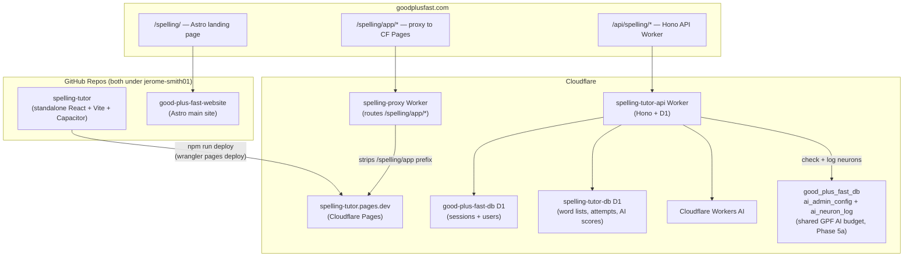

# Spelling Tutor — Action Plan
> Skill: `creating-new-features` | Repo: `jerome-smith01/spelling`

---

<a id="overall-status"></a>
## Overall Status

| Phase | Title | Status | Model | Tool | Depends On |
|-------|-------|--------|-------|------|------------|
| 0 | [Infrastructure & Repo Setup](#phase-0) | ✅ Complete | Gemini 3.8 Flash | Antigravity | None |
| 1 | [Standalone React App (Vite + PWA shell)](#phase-1) | ✅ Complete | Gemini 3.8 Flash | Antigravity | Phase 0 |
| 2 | [Core Spelling Features (all 7 from spec)](#phase-2) | ✅ Complete | Gemini 3.8 Flash | Antigravity | Phase 1 |
| 3 | [Cloudflare Backend API + D1 Schema](#phase-3) | ✅ Complete | Gemini 3.8 Flash | Antigravity | Phase 0 |
| 4 | [Auth Integration + User Data Sync](#phase-4) | ✅ Complete | Gemini 3.8 Flash | Antigravity | Phase 2, 3 |
| 5a | [Shared AI Quota + Sessions + Pattern Tagging](#phase-5a) | 🟡 Built and deployed — one menu check left | Claude Sonnet (High) | Antigravity | Phase 4 |
| 5b | [AI Kid Tips + Parent Pattern Reports](#phase-5b) | 🟡 Deployed — one manual check left | Gemini Pro (High) | Antigravity | Phase 5a |
| 5c | [Progress Dashboard + Weekly Digest](#phase-5c) | 🟡 Deployed — manual checks left | Claude Sonnet (Medium) | Antigravity | Phase 5b |
| 6 | [Astro Landing Page + Proxy Worker](#phase-6) | ✅ Complete | Gemini 3.8 Flash | Antigravity | Phase 1 |
| 7 | [Better TTS (Research)](#phase-7) | ✅ Complete — decision recorded | Gemini 3.8 Flash | Antigravity | Phase 2 |
| 8 | [Apps Hub + Docs](#phase-8) | 🔲 Not Started | Gemini 3.8 Flash | Antigravity | Phase 6 |
| 9 | [Admin: Uncaptured-Pattern Report](#phase-9) | 🔲 Not Started | Claude Sonnet (Medium) | Antigravity | Phase 5a |
| 10 | [Automatic Syllable Pronunciation (Prototype)](#phase-10) | 🔲 Not Started — plan only, no code yet | Claude Sonnet (High) | Antigravity | Phase 2 |

---

## Architecture Overview
[↑ Back to Table of Contents](#overall-status)


```mermaid
flowchart TD
    subgraph repos["GitHub Repos (both under jerome-smith01)"]
        A["spelling-tutor\n(standalone React + Vite + Capacitor)"]
        B["good-plus-fast-website\n(Astro main site)"]
    end

    subgraph cloudflare["Cloudflare"]
        CF_PAGES["spelling-tutor.pages.dev\n(Cloudflare Pages)"]
        CF_WORKER["spelling-tutor-api Worker\n(Hono + D1)"]
        CF_PROXY["spelling-proxy Worker\n(routes /spelling/app/*)"]
        CF_MAIN["good-plus-fast-db D1\n(sessions + users)"]
        CF_DB["spelling-tutor-db D1\n(word lists, attempts, AI scores)"]
        CF_AI["Cloudflare Workers AI"]
        CF_QUOTA["good_plus_fast_db\nai_admin_config + ai_neuron_log\n(shared GPF AI budget, Phase 5a)"]
    end

    subgraph gpf["goodplusfast.com"]
        LANDING["/spelling/ — Astro landing page"]
        APP["/spelling/app/* — proxy to CF Pages"]
        API["/api/spelling/* — Hono API Worker"]
    end

    A -->|"npm run deploy\n(wrangler pages deploy)"| CF_PAGES
    CF_PROXY -->|"strips /spelling/app prefix"| CF_PAGES
    APP --> CF_PROXY
    LANDING --> B
    CF_WORKER --> CF_DB
    CF_WORKER --> CF_MAIN
    CF_WORKER --> CF_AI
    CF_WORKER -->|"check + log neurons"| CF_QUOTA
    API --> CF_WORKER
```

### Key Architecture Decisions (all resolved)

| Decision | Choice | Reason |
|---|---|---|
| URL slug | `/spelling` | User confirmed |
| Repo strategy | Standalone repo | Independent deployment needed |
| Frontend stack | Vite + React | PWA + Capacitor (Android) compatible |
| Auth system | Existing GPF session cookie + `good_plus_fast_db` | Same pattern as Flashy Cards — zero new auth infrastructure |
| Backend | Hono on Cloudflare Workers + D1 | Same stack as Flashy Cards; Workers AI already available |
| Database | New `spelling-tutor-db` D1 | Separate from main site DB; joins to `good_plus_fast_db` for auth |
| Cloudflare vs Supabase | Cloudflare | Supabase is PTB's legacy; new apps use GPF unified auth |
| PWA | `vite-plugin-pwa` | Free PWA capability from the same Vite build |
| Android | Capacitor | Wraps the React web app — same codebase, same Web Speech API |
| Deployment | Own CF Pages project + proxy Worker | Like PTB but React instead of Flutter |
| Phase 1 persistence | LocalStorage | DB wired in Phase 4 |

---

## Open Questions (for you to answer before each phase)
[↑ Back to Table of Contents](#overall-status)

> [!IMPORTANT]
> **Before Phase 0:** Please create the GitHub repo at `jerome-smith01/spelling-tutor` (you already had the create page open). Leave it empty — I will push the first commit. Confirm when done.

> [!IMPORTANT]
> **Before Phase 3:** Confirm whether to create a brand-new Cloudflare D1 database named `spelling-tutor-db`, or if you'd prefer a different name. I'll provide the exact `wrangler` command to run.

> [!NOTE]
> **Phase 5 AI quota: RESOLVED (2026-09-26).** We'll use one daily neuron budget and kill switch shared across all GPF apps. `ai_admin_config` and `ai_neuron_log` move from the Flashy Cards DB into `good_plus_fast_db`, which both workers already bind. The main-site GPF API takes over the daily reset cron and the `/api/admin/ai-*` routes. See [Phase 5a](#phase-5a).

> [!IMPORTANT]
> **Before Phase 5a:** Confirm the main-site GPF API can host a cron trigger. If it runs as Astro on Pages, it can't, and we'll need a small `gpf-cron` Worker to do the daily budget reset.

> [!IMPORTANT]
> **Before Phase 5c:** Confirm which email sender the Flashy Cards admin emails use, and whether it's OK to send opt-in digest emails to end users (parents) through it.

> [!NOTE]
> **Family accounts (future phase):** Parents or teachers and children or students will share a family account. Parents set and assign words and monitor progress; children complete them. The new Phase 5 tables use a `learner_id` column, set equal to `user_id` for now, so child profiles can be mapped in later without a data migration.

> [!NOTE]
> **Android (deferred):** Staying a PWA for now; Capacitor/Android Studio only if the Play Store becomes a goal.

---

<a id="phase-0"></a>
## Phase 0 — Infrastructure & Repo Setup
[↑ Back to Table of Contents](#overall-status)

**Goal:** Create the Git repo, establish the file structure, connect to Cloudflare, and wire up the proxy so future phases have a deploy target from day one.

**Model:** `Claude Sonnet (Low effort)` — Antigravity
*Reason: Mechanical file/config creation with known patterns; no logic complexity.*

### File-Level Changes

| Action | File | Notes |
|--------|------|-------|
| NEW | `spelling_tutor/.gitignore` | Node + Vite standard |
| NEW | `spelling_tutor/README.md` | Project overview linking to spec, docs, and live URL |
| NEW | `spelling_tutor/package.json` | Vite + React + vite-plugin-pwa + Capacitor |
| NEW | `spelling_tutor/vite.config.js` | base: `/spelling/app/`, PWA plugin |
| NEW | `spelling_tutor/index.html` | React mount point |
| NEW | `spelling_tutor/src/main.jsx` | React root |
| NEW | `spelling_tutor/src/App.jsx` | Placeholder "coming soon" shell |
| NEW | `spelling_tutor/public/manifest.json` | PWA manifest |
| NEW | `spelling_tutor/tools/01.launch_dev.bat` | Starts Vite dev server locally |
| NEW | `spelling_tutor/tools/02.build_web.bat` | Clean Vite production build |
| NEW | `spelling_tutor/tools/03.publish_web_to_cloudflare.bat` | Builds, deploys to CF Pages, and purges CDN cache |
| NEW | `spelling_tutor/tools/04.arch_review.bat` | Inspects recent changes against architecture docs |
| NEW | `spelling_tutor/docs/architecture/00_overview.md` | Core architecture index & hard invariants (mirrors PTB) |
| NEW | `spelling_tutor/docs/architecture/01_platform_and_pwa.md` | PWA, Capacitor, and base-href routing rules |
| NEW | `Astro Project/spelling-proxy-worker.js` | CF Worker proxy (same pattern as `ptb-proxy-worker.js`) |
| NEW | `Astro Project/spelling-proxy-wrangler.toml` | Routes `goodplusfast.com/spelling/app*` |
| NEW | `Astro Project/apps/spelling-tutor-api/wrangler.jsonc` | Hono Worker skeleton |
| NEW | `Astro Project/apps/spelling-tutor-api/src/index.ts` | Empty Hono app with CORS + auth middleware copied from flashy-cards |
| NEW | `Astro Project/apps/spelling-tutor-api/migrations/0001_initial_schema.sql` | placeholder — full schema in Phase 3 |

### Key Patterns

**`vite.config.js`** (mirrors My Memory Flip but adds PWA):
```js
import { defineConfig } from 'vite'
import react from '@vitejs/plugin-react'
import { VitePWA } from 'vite-plugin-pwa'

export default defineConfig({
  plugins: [
    react(),
    VitePWA({
      registerType: 'autoUpdate',
      manifest: {
        name: 'Spelling Tutor',
        short_name: 'SpellingTutor',
        description: 'Practice spelling words with syllable-by-syllable guidance',
        theme_color: '#00008B',
        background_color: '#ffffff',
        display: 'standalone',
        start_url: '/spelling/app/',
        icons: [
          { src: '/icons/icon-192.png', sizes: '192x192', type: 'image/png' },
          { src: '/icons/icon-512.png', sizes: '512x512', type: 'image/png' },
        ]
      }
    })
  ],
  base: '/spelling/app/',
})
```

**`spelling-proxy-wrangler.toml`**:
```toml
name = "spelling-proxy"
main = "spelling-proxy-worker.js"
compatibility_date = "2026-01-01"

[[routes]]
pattern = "goodplusfast.com/spelling/app*"
zone_name = "goodplusfast.com"

[[routes]]
pattern = "www.goodplusfast.com/spelling/app*"
zone_name = "goodplusfast.com"
```

**`spelling-proxy-worker.js`** (identical pattern to `ptb-proxy-worker.js`):
```js
const PAGES_HOSTNAME = 'spelling-tutor.pages.dev';

export default {
  async fetch(request, env) {
    const url = new URL(request.url);
    if (url.pathname.startsWith('/spelling/app')) {
      const pagesUrl = new URL(request.url);
      pagesUrl.hostname = PAGES_HOSTNAME;
      pagesUrl.port = '';
      let stripped = pagesUrl.pathname.replace(/^\/spelling\/app/, '');
      if (stripped === '') return Response.redirect(url.origin + '/spelling/app/', 301);
      pagesUrl.pathname = stripped;
      const headers = new Headers(request.headers);
      headers.set('Host', PAGES_HOSTNAME);
      headers.delete('cf-connecting-ip');
      headers.delete('cf-ipcountry');
      headers.delete('cf-ray');
      headers.delete('cf-visitor');
      return fetch(new Request(pagesUrl.toString(), {
        method: request.method,
        headers,
        body: request.method !== 'GET' && request.method !== 'HEAD' ? request.body : null,
        redirect: 'follow',
      }));
    }
    return fetch(request);
  },
};
```

### Cloudflare Setup Steps (you run these manually)

```powershell
# 1. Create the Cloudflare Pages project (run once)
cd "C:\Users\Jerom\My Apps\spelling_tutor"
npx wrangler pages project create spelling-tutor

# 2. Create the D1 database (run once)
npx wrangler d1 create spelling-tutor-db
# → Copy the database_id it prints — you'll paste it into wrangler.jsonc

# 3. Deploy the proxy Worker (run once, then only if the proxy logic changes)
cd "C:\Users\Jerom\My Apps\Astro Project"
npx wrangler deploy spelling-proxy-worker.js --config spelling-proxy-wrangler.toml
```

### Manual Verification
- [ ] GitHub repo `jerome-smith01/spelling-tutor` visible and has first commit
- [ ] `npm run dev` in `spelling_tutor/` → loads placeholder "coming soon" React page at `localhost:5173/spelling/app/`
- [ ] `npm run build` succeeds, `dist/` folder created
- [ ] First deploy: `npx wrangler pages deploy dist --project-name=spelling-tutor` → live at `spelling-tutor.pages.dev/spelling/app/`
- [ ] Navigate to `goodplusfast.com/spelling/app/` → proxy forwards correctly to placeholder page

---

<a id="phase-1"></a>
## Phase 1 — Standalone React App Shell (Vite + PWA)
[↑ Back to Table of Contents](#overall-status)

**Goal:** Build the complete React app skeleton with routing, theme system (dark/light), shared layout, and the global CSS design system wired in — but no actual spelling features yet. This establishes every pattern the subsequent phases will follow.

**Model:** `Claude Sonnet (Medium effort)` — Antigravity
*Reason: Multi-file component structure with design system integration; clear patterns to follow from Flashy Cards.*

### File-Level Changes

| Action | File | Notes |
|--------|------|-------|
| NEW | `src/components/layout/AppShell.jsx` | Nav, theme toggle, auth-aware header |
| NEW | `src/components/layout/Header.jsx` | App title + user avatar/login button |
| NEW | `src/styles/global.css` | Import GPF design tokens + Comic Neue font |
| NEW | `src/styles/design-tokens.css` | Mirror GPF variables: `--background`, `--foreground`, `--color-primary`, etc. |
| NEW | `src/hooks/useTheme.js` | Dark/light toggle with localStorage persistence |
| NEW | `src/hooks/useAuth.js` | Read session cookie; expose `user` and `isLoggedIn` |
| NEW | `src/pages/PracticePage.jsx` | Placeholder for Phase 2 spelling UI |
| NEW | `src/pages/ProgressPage.jsx` | Placeholder for Phase 4 progress dashboard |
| MODIFY | `src/App.jsx` | Wire up router → PracticePage / ProgressPage |

### Key Pattern — Auth hook (no backend yet, reads the GPF cookie)
```js
// src/hooks/useAuth.js
export function useAuth() {
  const [user, setUser] = useState(null);

  useEffect(() => {
    // The session cookie is HttpOnly — we can't read it directly.
    // Instead, call the main site's /api/auth/me endpoint.
    fetch('https://www.goodplusfast.com/api/auth/me', { credentials: 'include' })
      .then(r => r.ok ? r.json() : null)
      .then(data => setUser(data?.user ?? null))
      .catch(() => setUser(null));
  }, []);

  return { user, isLoggedIn: !!user };
}
```

### Manual Verification
- [ ] Dark/light toggle works and persists on refresh
- [ ] On mobile: Comic Neue font renders, no autocapitalize issues
- [ ] Logged-in user (from goodplusfast.com session) sees their name in the header
- [ ] Anonymous user sees "Log In" button that links to `goodplusfast.com/login`
- [ ] PWA installable: Chrome shows "Add to Home Screen" prompt on mobile

---

<a id="phase-2"></a>
## Phase 2 — Core Spelling Features
[↑ Back to Table of Contents](#overall-status)

**Goal:** Implement all 7 features from the product spec as React components. Data stays in LocalStorage at this phase — no backend calls.

**Model:** `Claude Sonnet (High effort)` — Antigravity
*Reason: The most complex phase — 7 interactive features with keyboard handling, audio API, and progressive hiding logic that has many edge cases (mobile keyboards, backspace behavior, focus management).*

### File-Level Changes

| Action | File | Notes |
|--------|------|-------|
| NEW | `src/components/WordList.jsx` | Renders all word cards |
| NEW | `src/components/WordCard.jsx` | One word: syllable blocks + hide/show controls + audio button |
| NEW | `src/components/SyllableBlock.jsx` | One syllable group with letter boxes |
| NEW | `src/components/LetterInput.jsx` | Hidden letter → text input; auto-advance + smart backspace |
| NEW | `src/components/ImportModal.jsx` | Paste word list; AI prompt generator; one-click copy |
| NEW | `src/components/ColorPicker.jsx` | Success color selector with presets |
| NEW | `src/components/HideControls.jsx` | Global hide dropdown + "Hide All" button |
| NEW | `src/hooks/useWordList.js` | Parse, store, and retrieve word lists from localStorage |
| NEW | `src/hooks/useHiding.js` | Progressive hiding state machine per word |
| NEW | `src/hooks/useSpeech.js` | Web Speech API wrapper with try/catch fallback |
| NEW | `src/styles/spelling.css` | App-specific styles using GPF CSS variables |
| MODIFY | `src/pages/PracticePage.jsx` | Compose all components |

### Key Patterns

**Word format** (parsed from hyphenated import):
```js
// "con-trol" → { word: "control", syllables: [["c","o","n"], ["t","r","o","l"]] }
function parseWordList(raw) {
  return raw.trim().split('\n').map(line => {
    const syllables = line.trim().split('-');
    return {
      id: crypto.randomUUID(),
      raw: line.trim(),
      word: syllables.join(''),
      syllables: syllables.map(s => s.split('')),
      hidden: [],    // indices of hidden letters
      inputs: {},    // { letterIndex: typedChar }
    };
  });
}
```

**Auto-advance + smart backspace** (the trickiest UX detail from spec §3.5):
```jsx
function LetterInput({ value, onChange, onAdvance, onBackspace, inputRef }) {
  const handleKeyDown = (e) => {
    if (e.key === 'Backspace' && value === '') {
      e.preventDefault();
      onBackspace(); // jump to prev box AND delete its char
    }
  };
  const handleChange = (e) => {
    const char = e.target.value.slice(-1).toLowerCase();
    onChange(char);
    if (char) onAdvance(); // move to next box
  };
  return (
    <input
      ref={inputRef}
      type="text"
      maxLength={2}
      value={value}
      onChange={handleChange}
      onKeyDown={handleKeyDown}
      autoCapitalize="none"
      autoCorrect="off"
      spellCheck="false"
      className="letter-input"
    />
  );
}
```

**AI Prompt Generator** (§3.2 — no API call, just a copyable prompt):
```
You are a spelling assistant. I will give you a list of spelling words, 
a photo of a spelling list, or raw text. Return ONLY hyphenated lines, 
one word per line, using hyphens to separate syllables. No numbers, 
no explanations, no punctuation other than hyphens.

Example output:
con-trol
speak-er
pen-cil
bounce
```

### Accessibility
- All inputs have `aria-label="Letter [N] of word [word]"`
- Speaker button has `aria-label="Hear [word]"`
- Color picker meets WCAG AA contrast for success/error states
- Hide/Show buttons are keyboard focusable with visible focus ring
- Import modal traps focus while open

### Manual Verification
- [ ] Default word list loads and displays syllable blocks
- [ ] Import modal: paste `con-trol\nspeak-er` → words appear
- [ ] AI prompt modal: "Copy AI Prompt" copies to clipboard
- [ ] Type a letter → auto-advances to next hidden box
- [ ] Backspace in empty box → jumps to previous box and deletes its character
- [ ] Audio button speaks the word aloud
- [ ] "Hide 1 in 2" → every other letter becomes an input box
- [ ] "Hide All" hides all letters across all words
- [ ] Color picker: change success color → correct letters update immediately
- [ ] Dark mode: all elements readable
- [ ] Mobile (iOS Safari): no autocapitalize, no autocorrect interference
- [ ] Word list persists after browser refresh (LocalStorage)

---

<a id="phase-3"></a>
## Phase 3 — Cloudflare Backend API + D1 Schema
[↑ Back to Table of Contents](#overall-status)

**Goal:** Create the Hono Worker API and D1 database with all tables for user word lists, practice sessions, and the AI scoring engine. Deploy and verify the API is live — no frontend wiring yet.

**Model:** `Claude Sonnet (High effort)` — Antigravity
*Reason: Database schema design with auth middleware is security-sensitive; mistakes here are hard to undo in production.*

### File-Level Changes

| Action | File | Notes |
|--------|------|-------|
| NEW | `apps/spelling-tutor-api/migrations/0001_initial_schema.sql` | Core tables |
| NEW | `apps/spelling-tutor-api/migrations/0002_add_ai_scores.sql` | AI engine tables |
| NEW | `apps/spelling-tutor-api/src/index.ts` | Full Hono app with auth middleware + all routes |
| NEW | `apps/spelling-tutor-api/package.json` | Hono, zod, uuid |
| NEW | `apps/spelling-tutor-api/wrangler.jsonc` | D1 bindings for both DBs |

### D1 Schema

**`0001_initial_schema.sql`**:
```sql
-- Shadow users table (auth is in good_plus_fast_db)
CREATE TABLE IF NOT EXISTS users (
  id   TEXT PRIMARY KEY,   -- matches users.id in good_plus_fast_db
  email TEXT NOT NULL,
  created_at DATETIME DEFAULT CURRENT_TIMESTAMP
);

-- Word lists (custom imports)
CREATE TABLE IF NOT EXISTS word_lists (
  id         TEXT PRIMARY KEY,
  user_id    TEXT NOT NULL REFERENCES users(id) ON DELETE CASCADE,
  name       TEXT NOT NULL,          -- e.g. "Week 3 — October"
  words_raw  TEXT NOT NULL,          -- raw hyphenated text, one word per line
  is_default INTEGER DEFAULT 0,      -- 1 = currently active list
  created_at DATETIME DEFAULT CURRENT_TIMESTAMP,
  updated_at DATETIME DEFAULT CURRENT_TIMESTAMP
);

-- Per-attempt history (one row per letter typed)
CREATE TABLE IF NOT EXISTS attempts (
  id           TEXT PRIMARY KEY,
  user_id      TEXT NOT NULL REFERENCES users(id) ON DELETE CASCADE,
  word         TEXT NOT NULL,
  letter       TEXT NOT NULL,        -- the letter being tested
  position     INTEGER NOT NULL,     -- position in word
  correct      INTEGER NOT NULL,     -- 0 or 1
  practiced_at DATETIME DEFAULT CURRENT_TIMESTAMP
);

CREATE INDEX IF NOT EXISTS idx_word_lists_user ON word_lists(user_id);
CREATE INDEX IF NOT EXISTS idx_attempts_user   ON attempts(user_id);
CREATE INDEX IF NOT EXISTS idx_attempts_word   ON attempts(user_id, word);
```

**`0002_add_ai_scores.sql`**:
```sql
-- Aggregated struggle score per word per user (updated by API on each session end)
CREATE TABLE IF NOT EXISTS word_scores (
  id             TEXT PRIMARY KEY,
  user_id        TEXT NOT NULL REFERENCES users(id) ON DELETE CASCADE,
  word           TEXT NOT NULL,
  attempt_count  INTEGER DEFAULT 0,
  error_count    INTEGER DEFAULT 0,
  friction_score INTEGER DEFAULT 0,  -- same algorithm as Flashy Cards Leech Hunter
  ai_suggestion  TEXT,               -- JSON: { tip, mnemonic, breakdown }
  last_practiced DATETIME,
  UNIQUE(user_id, word)
);

CREATE INDEX IF NOT EXISTS idx_word_scores_user ON word_scores(user_id);
```

### API Routes (Hono)

```
POST   /api/spelling/lists          — save a word list
GET    /api/spelling/lists          — get all user lists
DELETE /api/spelling/lists/:id      — delete a list
POST   /api/spelling/attempts       — record a practice session (batch)
GET    /api/spelling/scores         — get all word scores for user
GET    /api/spelling/scores/hardest — top N hardest words (friction_score DESC)
POST   /api/spelling/scores/:word/analyze — trigger AI suggestion
```

### `wrangler.jsonc`
```jsonc
{
  "name": "spelling-tutor-api",
  "main": "src/index.ts",
  "compatibility_date": "2026-09-01",
  "d1_databases": [
    {
      "binding": "spelling_db",
      "database_name": "spelling-tutor-db",
      "database_id": "PASTE_ID_FROM_PHASE_0_HERE"
    },
    {
      "binding": "good_plus_fast_db",
      "database_name": "good-plus-fast-db",
      "database_id": "9ca0b62f-289f-44b7-b3b0-2acabbfc7d5d"
    }
  ],
  "ai": { "binding": "AI" }
}
```

### Auth Middleware (copied from Flashy Cards — identical pattern)
Session cookie → `good_plus_fast_db` session lookup → upsert into `spelling_db users` → attach `userId` to context.

### Cloudflare Setup Steps (you run these)
```powershell
cd "C:\Users\Jerom\My Apps\Astro Project\apps\spelling-tutor-api"

# Apply migrations to remote DB
npx wrangler d1 migrations apply spelling-tutor-db --remote

# Deploy the API Worker
npx wrangler deploy
```

### Manual Verification
- [ ] `GET https://spelling-tutor-api.<your-account>.workers.dev/api/spelling/lists` with a valid session cookie → returns `[]`
- [ ] Without a cookie → returns `401 Unauthorized`
- [ ] Tables visible in Cloudflare dashboard → D1 → `spelling-tutor-db`

---

<a id="phase-4"></a>
## Phase 4 — Auth Integration + User Data Sync
[↑ Back to Table of Contents](#overall-status)

**Goal:** Wire the React app's word lists and practice results to the Cloudflare API. Users who are logged in get cloud sync; anonymous users stay on LocalStorage.

**Model:** `Claude Sonnet (High effort)` — Antigravity
*Reason: Auth-aware data layer with graceful fallback to LocalStorage; syncing edge cases (offline, expired session) need careful handling.*

### File-Level Changes

| Action | File | Notes |
|--------|------|-------|
| NEW | `src/services/apiService.js` | Fetch wrapper with credentials; mirrors flashy-cards pattern |
| NEW | `src/services/storageService.js` | Read/write word lists — tries API first, falls back to localStorage |
| NEW | `src/services/sessionService.js` | Batch-submit practice attempts at end of session |
| NEW | `src/components/AuthBanner.jsx` | "Log in to save your word lists" banner for anonymous users |
| NEW | `src/components/WordListManager.jsx` | List selector dropdown; save/delete lists by name |
| MODIFY | `src/hooks/useWordList.js` | Delegate to storageService instead of direct localStorage |
| MODIFY | `src/pages/PracticePage.jsx` | Add session-end callback → submit attempts |
| MODIFY | `src/pages/ProgressPage.jsx` | Fetch and display word scores |

### Sync Strategy
```
On app load:
  if (isLoggedIn):
    fetch /api/spelling/lists → set as available lists
    fetch /api/spelling/scores → preload friction scores
  else:
    read from localStorage

On word list save:
  if (isLoggedIn): POST /api/spelling/lists
  else: localStorage

On session complete (user finishes practicing a list):
  if (isLoggedIn): POST /api/spelling/attempts (batch)
  → server updates word_scores friction scores
```

### Manual Verification
- [ ] Logged-in user: save a word list → refresh → list still there (from API)
- [ ] Anonymous user: save a word list → refresh → list still there (from localStorage)
- [ ] Logged-in user: practice session completes → navigate to `/progress` → words attempted show scores
- [ ] Session expires mid-practice → graceful error banner, data not lost (falls back to localStorage)
- [ ] "Log in to save your progress" banner visible for anonymous users

---

<a id="phase-5"></a>
## Phase 5 — AI Struggling-Areas & Pattern Engine (overview)
[↑ Back to Table of Contents](#overall-status)

**Goal:** Help children with the specific words they keep missing, and show parents the *spelling patterns* behind those misses. For example: "keeps dropping the silent e", "confuses b/d", "misses doubled consonants before -ing". Phase 5 is split into three sessions: **5a** covers data and scoring with no AI output, **5b** adds the AI output, and **5c** builds the dashboard and weekly digest.

### Decisions (interview, 2026-09-26)
| Topic | Decision |
|---|---|
| AI quota | One **shared GPF daily neuron budget** and kill switch. The tables move to `good_plus_fast_db`. |
| Quota owner | The main-site GPF API owns the daily reset cron and `/api/admin/ai-*`. `admin/ai-credits.astro` gets repointed to it. |
| What counts as a miss | **Final answer only.** Each hidden letter's *last* answer within a session counts. Raw Check rows are still stored. |
| Session | **One visit to a list.** The client creates a `session_id` each time a list is opened for practice. |
| Mastery | **3 perfect sessions in a row** for a word reset its friction score to 0 and clear its kid tip. |
| Scope | Friction is tracked **per word**. Patterns are tracked **across all words and lists** for a learner. |
| Pattern detection | **Deterministic rules tag, AI explains.** The server tags each letter position with pattern categories for free. The AI only writes explanations. |
| Audience | **Both.** A kid-friendly tip per struggling word, plus a parent-facing pattern report. |
| Word flames | Kept. 🔥 at friction ≥ 40; the AI kid tip auto-generates at ≥ 70 and is cached. |
| Pattern report timing | (1) Auto-generated when a pattern first qualifies, then cached. It regenerates only if the pattern clears and later returns. (2) A weekly digest built by cron. |
| Digest delivery | In-app on the Progress page, plus an **opt-in** email to the parent with an unsubscribe link. |
| Anonymous users | Flames are computed client-side from localStorage. **All AI requires login.** |
| Progress UI | Mastered / Struggling / Needs-practice buckets, plus a Patterns section for parents. |
| Future families | New tables key on `learner_id`, which equals `user_id` for now. |
| Uncaptured patterns | Admin report of misses that no rule tags. Moved to [Phase 9](#phase-9). |

### Pattern Categories (v1 — K–5)
| Category key | Covers | Example |
|---|---|---|
| `silent_letters` | Silent e / VCe ("magic e"), kn, wr, gh, mb, silent h | make, knee, write, lamb |
| `double_consonants` | ll/ss/ff/zz floss rule, doubling before -ing/-ed, missing or extra doubles | hopping, bell |
| `vowel_teams` | ai/ay, ee/ea, oa/ow, oi/oy, ou/ow, igh, ew/ue | rain, boat, night |
| `r_controlled` | ar, er, ir, ur, or | bird, turn |
| `digraphs` | ch, sh, th, wh, ph, ng | ship, phone |
| `endings` | -tion, -ed, -le, -ing, -er, -est | nation, little |
| `short_vowels` | CVC vowel swaps (a/e/i/o/u) | cat vs "cet" |
| `schwa` | Unstressed-syllable vowels | pencil → "pencel" |
| `blends` | bl, cl, st, str, spl, nd, mp | stamp, string |
| `soft_c_g` | c/g before e/i/y | city, gem |
| `ck_dge_tch` | -ck vs -k, -dge, -tch | back, badge, catch |
| `plurals` | -s vs -es, y → ies, f → ves | boxes, babies |
| `prefixes` | un-, re-, pre-, dis- | unhappy |
| `y_rules` | y as a vowel, y → i before suffixes | happy, happier |
| `contractions` | Apostrophe placement | don't, it's |
| `reversals` | b/d, p/q, n/u swaps (needs the `typed` letter) | "bog" for dog |
| `open_syllables` | One-syllable words ending in a vowel that says its name (multi-syllable needs syllable data, later) | me, hi, go |
| `drop_silent_e` | Dropping the e before -ing (tagged on the suffix's first letter) | making |
| `c_vs_k_initial` | Hard /k/ at the start: c before a/o/u, k before e/i/y | cat, kite |
| `high_frequency_irregular` | Sight words that must be memorised (list-based) | said, was, could |
| `roots` | Greek/Latin roots (list-based, grades 4-5) | graph, photo, phon |

A letter position can have **several** tags. Misses that match no tag are recorded as `untagged`, which feeds the Phase 9 admin report.

### Thresholds (defaults, tunable constants)
| Constant | Default | Meaning |
|---|---|---|
| `FLAME_THRESHOLD` | 40 | Show 🔥 on the word card |
| `AI_TIP_THRESHOLD` | 70 | Auto-generate the kid tip (first crossing only) |
| `MASTERY_STREAK` | 3 | Perfect sessions in a row that reset friction |
| `PATTERN_QUALIFY` | ≥ 3 distinct words missed across ≥ 2 sessions within 30 days | Pattern becomes "active", which triggers the parent report |
| `PATTERN_CLEAR` | ≥ 90% correct over its last 10 tagged letters | Pattern becomes "cleared" |

---

<a id="phase-5a"></a>
## Phase 5a — Shared AI Quota + Sessions + Pattern Tagging
[↑ Back to Table of Contents](#overall-status)

**Goal:** Build everything Phase 5 needs *except* AI output:
- the shared GPF quota tables
- session-aware scoring
- mastery reset
- the deterministic pattern tagger with pattern stats
- the 🔥 flame (which also works for anonymous users)

**Model:** `Claude Sonnet (High effort)` — Antigravity
*Reason: Cross-repo schema migrations (GPF DB, spelling DB, Flashy Cards refactor) plus a rules engine that needs unit tests. Correctness matters more than creativity here.*

### File-Level Changes

| Action | File | Notes |
|--------|------|-------|
| NEW | `Astro Project/<gpf-db migrations>/00XX_shared_ai_quota.sql` | `ai_admin_config` (key/value) and `ai_neuron_log` (+ an `app` column) in `good_plus_fast_db`. Copies the current Flashy values over. |
| ~~MODIFY~~ DEFERRED | Main-site GPF API / `gpf-cron` Worker | **Not done in 5a.** The main site is an Astro worker with no `scheduled` handler, so moving the cron needs a new worker. The reset cron, report email and `/api/fc/admin/ai-*` stay in the Flashy Cards worker, now operating on the shared tables. |
| MODIFY | `jerome-portfolio/src/pages/admin/ai-credits.astro` | Point at the shared admin routes and show a per-app breakdown |
| MODIFY | `Astro Project/apps/flashy-cards-api/src/index.ts` | Read and write the shared tables, using an **atomic** `UPDATE ... RETURNING` counter and a conditional kill-switch flip (only one request sends the email). **Fix:** the auto-trigger (≈ line 635) must check the kill switch. Remove its own cron reset. |
| NEW | `apps/spelling-tutor-api/migrations/0003_sessions_patterns.sql` | See the schema below |
| NEW | `apps/spelling-tutor-api/src/lib/patternTagger.ts` | Pure `tagWord(word) → [{ position, patterns[] }]`, with one rule module per category |
| NEW | `apps/spelling-tutor-api/src/lib/patternTagger.test.ts` | Table-driven tests covering every category, plus multi-tag and untagged cases |
| NEW | `apps/spelling-tutor-api/src/lib/scoring.ts` | Session-aware friction, mastery streak, and pattern stats update. It updates incrementally instead of rereading the full history. |
| MODIFY | `apps/spelling-tutor-api/src/index.ts` | `POST /attempts` accepts `session_id` and `typed`, upserts `practice_sessions`, and calls `scoring.ts`. Adds `GET /api/spelling/patterns`. |
| MODIFY | `src/pages/PracticePage.jsx` | Create a `session_id` (UUID) whenever a list is opened for practice |
| MODIFY | `src/components/WordCard.jsx` | `handleVerify` also sends `typed` and `session_id`; show `StruggleIndicator` |
| MODIFY | `src/services/attemptQueue.js` | Carry `session_id` and `typed` |
| NEW | `src/components/StruggleIndicator.jsx` | 🔥 when friction ≥ 40, with an `aria-label` such as "Tricky word" |
| NEW | `src/utils/friction.js` | Client-side port of the friction and final-answer logic, used for anonymous users' flames from localStorage |

### Schema — `0003_sessions_patterns.sql`
```sql
ALTER TABLE attempts ADD COLUMN session_id TEXT;
ALTER TABLE attempts ADD COLUMN typed      TEXT;        -- what the child actually typed ('' = blank)
ALTER TABLE attempts ADD COLUMN learner_id TEXT;        -- = user_id until family accounts
CREATE INDEX IF NOT EXISTS idx_attempts_session ON attempts(learner_id, session_id);

CREATE TABLE IF NOT EXISTS practice_sessions (
  id            TEXT PRIMARY KEY,                       -- client-generated UUID
  learner_id    TEXT NOT NULL,
  list_id       TEXT,
  started_at    DATETIME DEFAULT CURRENT_TIMESTAMP,
  last_seen_at  DATETIME DEFAULT CURRENT_TIMESTAMP
);

ALTER TABLE word_scores ADD COLUMN perfect_streak INTEGER DEFAULT 0;

CREATE TABLE IF NOT EXISTS pattern_stats (
  learner_id            TEXT NOT NULL,
  pattern               TEXT NOT NULL,                  -- category key, or 'untagged'
  attempts              INTEGER DEFAULT 0,              -- final answers on tagged letters
  misses                INTEGER DEFAULT 0,
  missed_words_json     TEXT,                           -- recent missed words + typed vs expected
  status                TEXT DEFAULT 'watching',        -- watching | active | cleared
  first_qualified_at    DATETIME,
  report_json           TEXT,                           -- Phase 5b parent report cache
  report_generated_at   DATETIME,
  updated_at            DATETIME DEFAULT CURRENT_TIMESTAMP,
  PRIMARY KEY (learner_id, pattern)
);
```

### Scoring Rules
- **Final answer:** within a `session_id`, only the last attempt per (word, position) counts. Scoring re-runs for the affected session's words whenever a batch arrives, and is idempotent.
- **Friction:** the existing letter-level algorithm (`+10 × consecutive misses`, `−5` per correct answer), applied to *final answers per session* instead of raw Check presses.
- **Mastery:** a session where every hidden letter in the word ends up correct increments `perfect_streak`. Any miss resets it to 0. At 3, set `friction_score = 0` and `ai_suggestion = NULL`.
- **Patterns:** each final-answer letter is tagged with `tagWord()`, which updates `pattern_stats` counts and `status` using `PATTERN_QUALIFY` / `PATTERN_CLEAR`.

### Implementation notes (as built)
- Friction reads at most the last 400 attempts per word, and pattern stats recompute from the last 30 days (max 3000 rows) per batch. This is a bounded recompute rather than a true incremental update, and it is idempotent.
- `pattern_stats.cleared_at` was added so old misses cannot flip a cleared pattern straight back to active.
- `word_scores.mastered_at` was added: attempts before it stop counting toward friction.
- Details: [`architecture/05_ai_engine.md`](architecture/05_ai_engine.md).

### Manual Verification
- [ ] Logged in as the admin (`goodplusfast@gmail.com`), an "AI Credits" link appears in the account menu (desktop dropdown and phone menu) and opens `/admin/ai-credits`; a normal user does not see it (the rule is covered by tests, the look is not)

---

<a id="phase-5b"></a>
## Phase 5b — AI Kid Tips + Parent Pattern Reports
[↑ Back to Table of Contents](#overall-status)

**Goal:** Generate and show AI output within the shared GPF budget: a kid-friendly tip for each struggling word, and a parent report for each active pattern.

**Model:** `Gemini Pro (High effort)` — Antigravity
*Reason: Prompt engineering for two audiences (child and parent), plus JSON robustness and quota-safe async generation.*

### File-Level Changes

| Action | File | Notes |
|--------|------|-------|
| NEW | `apps/spelling-tutor-api/src/lib/aiQuota.ts` | `checkQuota()` runs before **every** AI call (kill switch + daily limit); `logNeurons(app='spelling')` runs after. Uses the shared `good_plus_fast_db` tables. |
| NEW | `apps/spelling-tutor-api/src/lib/prompts.ts` | Kid tip prompt and parent pattern prompt |
| MODIFY | `apps/spelling-tutor-api/src/index.ts` | Auto-generation via `waitUntil`: a kid tip when a word first crosses 70, a parent report when a pattern first becomes `active`. New routes: `POST /scores/:word/analyze` and `POST /patterns/:pattern/analyze`. Both return the cache first, or 503 if AI is disabled. |
| NEW | `src/components/Modal.jsx` | Shared dialog with focus trap, Esc to close, and `aria-modal` |
| NEW | `src/components/AITipModal.jsx` | Kid view, opened by tapping 🔥: tip, mnemonic and breakdown |
| NEW | `src/components/PatternReportModal.jsx` | Parent view: summary, why it happens, practice ideas and example words |
| MODIFY | `src/services/apiService.js` | `getPatterns`, `analyzeWord`, `analyzePattern` |

### Kid Tip Prompt (`@cf/meta/llama-3.1-8b-instruct`)
```
You are a spelling coach for elementary students (K–5). The student keeps
misspelling "${word}" (syllables: ${syllables.join('-')}). Tricky letters:
${trickyPositions} (they typed ${typedVsExpected}).

Respond with ONLY valid JSON:
- "tip": one short, child-friendly memory trick
- "mnemonic": a fun rhyme or mini-story for the tricky part
- "breakdown": how each syllable sounds and is spelled

Use simple words a 3rd grader can read. No markdown.
```

### Parent Pattern Report Prompt
```
You are a reading specialist writing to a parent of a K–5 child.
Pattern: ${patternName} (${patternDescription}).
Recently missed words (expected → typed): ${examples}.

Respond with ONLY valid JSON:
- "summary": 1–2 sentences naming the pattern in plain language
- "why_it_happens": why children commonly struggle with this
- "practice_ideas": array of 3 short at-home activities
- "example_words": array of 5 age-appropriate practice words with this pattern

Warm, encouraging, jargon-free. No markdown.
```

### Implementation notes (as built)
- Every AI call goes through `aiQuota.ts` (`checkQuota` before, `logNeurons` after), including the fire-and-forget auto-triggers. There is also a per-user cap of 20 AI generations a day.
- A model response is parsed as JSON, shape-checked, length-clamped and sanitised before it is stored. Words and letters put into prompts are validated first.
- After an attempts batch, at most 3 jobs are queued (parent reports first, then kid tips) to protect the budget.
- A manual `analyze` only generates for words at or above the flame threshold, and only for `active` patterns. Cached results are always served, even while AI is disabled.
- Automated coverage: `ai.test.ts`, `api.test.ts` (API), and `Modal`, `AITipModal`, `PatternReportModal`, `StruggleIndicator`, `WordCard.coaching` tests (client).

### Manual Verification
- [ ] With the real Cloudflare Workers AI, a kid tip and a parent report read well (tone, spelling, and that the advice makes sense for the pattern). Tests use a stand-in model, so real output quality is the one thing they cannot judge.

---

<a id="phase-5c"></a>
## Phase 5c — Progress Dashboard + Weekly Digest
[↑ Back to Table of Contents](#overall-status)

**Goal:** Rebuild the Progress page around buckets and patterns, fill in the word-detail page, and send a weekly digest in-app plus an opt-in email.

**Model:** `Claude Sonnet (Medium effort)` — Antigravity
*Reason: UI composition over existing data, plus a cron job following the established Flashy Cards pattern.*

### File-Level Changes

| Action | File | Notes |
|--------|------|-------|
| MODIFY | `src/pages/ProgressPage.jsx` | Buckets (**Mastered**: streak ≥ 3 · **Struggling**: 🔥 ≥ 40 · **Needs practice**: 0 < friction < 40), plus a **Patterns** section with active and cleared patterns and a "Read report" button |
| NEW | `src/pages/WordDetailPage.jsx` | Replaces the `/progress/words/:word` stub: letter-level miss heatmap, session history and the kid tip |
| NEW | `src/components/DigestCard.jsx` | Latest weekly digest shown at the top of Progress |
| NEW | `src/components/DigestEmailToggle.jsx` | Opt-in switch for the weekly email |
| NEW | `apps/spelling-tutor-api/migrations/0004_weekly_digests.sql` | `weekly_digests (learner_id, week_start, digest_json)` and `digest_prefs (user_id, email_opt_in, unsubscribe_token)` |
| MODIFY | `apps/spelling-tutor-api/wrangler.jsonc` | Weekly cron, e.g. `0 13 * * SUN` (Sunday) |
| MODIFY | `apps/spelling-tutor-api/src/index.ts` | `scheduled()` builds the digest for learners active that week (AI summary through `aiQuota`) and emails those who opted in. Adds `GET /digest/latest`, `PUT /digest/prefs` and `GET /digest/unsubscribe?token=` |

### Implementation notes (as built)
- Digest period is the 7 days before the run; one row per learner per period is stored (re-running replaces it). The AI writes the summary sentence when the budget allows it; otherwise a plain template is used, so a digest never fails because AI is off.
- The digest email is opt-in (off by default), is sent only to the account's own address, and every email carries an unsubscribe link. The unsubscribe endpoint needs no login and gives the same page for any token.
- The weekly cron runs at `0 13 * * SUN` (Sundays, 13:00 UTC) on `spelling-tutor-api`.
- `/progress/words/:word` shows a letter-by-letter result for one word (miss counts are written out, not shown by color alone) and its tip.
- Automated coverage: `digest.test.ts`, `api.test.ts` (API), and `progress`, `DigestCard`, `DigestEmailToggle`, `WordBuckets`, `PatternList`, `ProgressPage`, `WordDetailPage`, `useStruggle` tests (client).

### Deploy steps (yours to run)
```powershell
cd "C:\Users\Jerom\My Apps\Astro Project\apps\spelling-tutor-api"
npx wrangler d1 migrations apply spelling-tutor-db --remote   # applies 0004_weekly_digests.sql
npx wrangler deploy                                            # also registers the weekly cron
```
Then deploy the spelling app to Pages. The "Coming soon" badges for AI Coaching and parent reports on the `/spelling/` landing page have been removed, and the home page now lists Spelling Tutor (marked Beta).

### Manual Verification
- [ ] After deploying, the weekly cron trigger (`0 13 * * SUN`) appears under the `spelling-tutor-api` worker's Triggers tab in the Cloudflare dashboard
- [ ] Turn on the weekly email, trigger the job once, and confirm the email really arrives and its unsubscribe link works. Delivery goes through MailChannels, which tests cannot reach, and MailChannels may now need an API key.
- [ ] The new Progress and word-detail pages look right in dark mode and on a phone

---

<a id="phase-6"></a>
## Phase 6 — Astro Landing Page + Proxy Worker Deploy
[↑ Back to Table of Contents](#overall-status)

**Goal:** Create the `goodplusfast.com/spelling` landing page in the Astro main site (modeled after `/bible/`), and verify the full proxy pipeline is live in production.

**Model:** `Claude Sonnet (Low effort)` — Antigravity
*Reason: Mechanical Astro page creation following an established template.*

### File-Level Changes

| Action | File | Notes |
|--------|------|-------|
| NEW | `jerome-portfolio/src/pages/spelling/index.astro` | Landing page |
| NEW | `jerome-portfolio/src/pages/spelling/app/[...path].ts` | SSR proxy route (mirrors `bible/pwa/[...path].ts`) |
| MODIFY | `WEBSITE_PAGES.md` | Document new pages and API routes |

### Landing Page Structure (mirrors `/bible/`)
```
Hero:
  - App title "Spelling Tutor" (app-title animated gradient class)
  - Tagline: "Practice weekly spelling words, syllable by syllable."
  - "Open App" CTA button → /spelling/app/
  - Phone mockup showing a word card with hidden letters

Features Section:
  - 3 feature cards: Syllable Practice | Progress Tracking | AI Coaching

"How It Works" Section (3 steps)

Accessibility / Parent Section:
  - Explains AI prompt generator for easy word list imports
  - "Works offline" badge (PWA)
  - "Android coming soon" badge
```

### `jerome-portfolio/src/pages/spelling/app/[...path].ts`
```ts
import type { APIRoute } from 'astro';
const PAGES_HOSTNAME = 'spelling-tutor.pages.dev';

export const ALL: APIRoute = async ({ request, url }) => {
  const pagesUrl = new URL(url);
  pagesUrl.hostname = PAGES_HOSTNAME;
  pagesUrl.port = '';
  let stripped = pagesUrl.pathname.replace(/^\/spelling\/app/, '');
  if (stripped === '') return Response.redirect(url.origin + '/spelling/app/', 301);
  pagesUrl.pathname = stripped;
  const headers = new Headers(request.headers);
  headers.set('Host', PAGES_HOSTNAME);
  headers.delete('cf-connecting-ip');
  headers.delete('cf-ipcountry');
  headers.delete('cf-ray');
  headers.delete('cf-visitor');
  return fetch(new Request(pagesUrl.toString(), {
    method: request.method, headers,
    body: request.method !== 'GET' && request.method !== 'HEAD' ? await request.arrayBuffer() : null,
    redirect: 'follow',
  }));
};
```

### Manual Verification
- [ ] `goodplusfast.com/spelling/` → landing page loads
- [ ] "Open App" button → navigates to `goodplusfast.com/spelling/app/`
- [ ] App fully functional from the production URL
- [ ] Dark mode on landing page matches site-wide theme
- [ ] Mobile: landing page looks good on iPhone/Android

---

<a id="phase-7"></a>
## Phase 7 — Better Text-to-Speech (Research)
[↑ Back to Table of Contents](#overall-status)

**Goal:** Decide how the PWA gets higher-quality, consistent voices for free, without slowing down users' phones. **Research phase — no code until we pick an approach.**

**Model:** `Claude Sonnet (Medium effort)` — Antigravity
*Reason: Comparison and prototyping with some judgment calls; low implementation volume.*

> [!NOTE]
> **Android/Capacitor is deferred.** We are staying a PWA. The app isn't going in the Play Store yet, and the PWA already installs and works offline on Android. Revisit only if store discoverability or native APIs become a real need. (Old plan: `@capacitor/*`, `capacitor.config.json`, `tools/11.build_android.bat`, Android Studio.)

### Constraints
- **Free** (or free within generous tiers). No per-use cost that scales with users.
- **No heavy work on the user's phone.** No large model downloads or slow on-device inference on low-end devices.
- **Hostable on Cloudflare** (Workers, R2, Pages) **or** callable as an API from a Worker.
- Works offline for words the learner has already practiced, where possible.

### Options to Research

| # | Approach | Where it runs | Phone impact | Cost | Open questions |
|---|----------|---------------|--------------|------|----------------|
| A | **Pre-generated audio** (Piper/Kokoro run once on your PC → MP3 in R2, plain `<audio>` playback) | Build time / your machine | Minimal | Free (R2 free tier) | How to handle user-created words not in the pre-generated set? |
| B | **Cloudflare Workers AI TTS** (e.g. MeloTTS) called from the Worker, cached in R2 | Cloudflare edge | Minimal | Free daily neuron allowance, then paid | Current model list, free-tier limits, voice quality, latency |
| C | **Hosted API free tiers** (Google Cloud TTS ~1M chars/mo, Azure ~500k chars/mo) via the Worker, cached in R2 | Provider | Minimal | Free tier, then paid | Key management, quota safety, terms on caching audio |
| D | **On-device neural TTS** (Kokoro via `kokoro-js`, Piper WASM) | User's phone | **High** (50-80 MB download, slow on weak phones) | Free | Likely rejected by the "no slowdown" constraint; test on a low-end phone before ruling out |
| E | **`speechSynthesis`** (current) | User's device | None | Free | Voice quality varies by device; keep as fallback |

### Likely Architecture (to validate)
1. Word/sentence requested → check R2 cache by hash of `(text, voice)`.
2. Cache hit → return the audio URL; the client plays it with `<audio>` and the service worker caches it for offline use.
3. Cache miss → Worker generates via B or C, stores in R2, returns it.
4. Generation fails or the user is offline with no cached audio → fall back to `speechSynthesis`.

This keeps the phone doing only playback, and each unique word is generated at most once, so cost stays near zero.

### Research Tasks
- [ ] Confirm current Workers AI TTS models, voices, free-tier limits, and pricing beyond the free tier
- [ ] Compare Google/Azure free-tier limits and their terms on storing/caching generated audio
- [ ] Generate the same 10 test words with Piper, Kokoro, Workers AI, and Google Neural2; pick a winner by ear (clarity of single words matters more than sentence flow)
- [ ] Estimate volume: unique words per list × expected lists → will we stay inside the free tier?
- [ ] Check R2 free-tier storage/operations against expected audio size (~10-30 KB per word)
- [ ] Decide the approach for custom user words (on-demand generation vs. fallback to `speechSynthesis`)
- [ ] Decide whether pre-generating a common word bank (e.g. grade-level lists) is worth doing up front
- [ ] Check how current dictation uses `speechSynthesis` so the new engine slots in behind the same interface

### Deliverable
A short decision record in `docs/architecture/` (e.g. `06_tts_decision.md`) covering the chosen approach, rejected options with reasons, the cache/fallback design, and a follow-up implementation phase if warranted.

**Decision:** [`architecture/06_tts_decision.md`](architecture/06_tts_decision.md) — pre-generated Kokoro audio cached in R2 (Option A), with `speechSynthesis` fallback for un-generated custom words (Option E). Server-generated options (B/C) and on-device neural TTS (D) were considered and rejected; see the decision record for reasoning and free-tier math. A follow-up implementation phase (proposed "Phase 7b") is not yet scheduled.

### Manual Verification
- [x] Sample audio for each candidate reviewed (via published comparisons) and a winner chosen — Kokoro
- [x] Free-tier math shows we stay within limits at expected usage
- [x] Decision record written and this plan updated with an implementation phase

---

<a id="phase-8"></a>
## Phase 8 — Apps Hub Update + Documentation
[↑ Back to Table of Contents](#overall-status)

**Goal:** Add the Spelling Tutor card to the `/apps` page, update `WEBSITE_PAGES.md`, and write the action plan docs.

**Model:** `Claude Sonnet (Low effort)` — Antigravity
*Reason: Simple page edits following established patterns.*

### File-Level Changes

| Action | File | Notes |
|--------|------|-------|
| MODIFY | `jerome-portfolio/src/pages/apps.astro` | Add Spelling Tutor AppCard |
| MODIFY | `WEBSITE_PAGES.md` | Document all new pages and `/api/spelling/*` routes |
| NEW | `spelling_tutor/docs/action_plans/spelling_tutor_launch_task_list.md` | This document, saved to repo |
| NEW | `spelling_tutor/docs/architecture/01_overview.md` | Architecture doc for the repo |

### Manual Verification
- [ ] `/apps` page shows Study Buddy, Pray the Bible, and Spelling Tutor cards
- [ ] Spelling Tutor card links to `/spelling/`

---

<a id="phase-9"></a>
## Phase 9 — Admin: Uncaptured-Pattern Report
[↑ Back to Table of Contents](#overall-status)

**Goal:** As the global admin, see which missed letters in the words users load are **not captured by any pattern rule**, so we can decide which new rules to add to `patternTagger.ts`.

**Model:** `Claude Sonnet (Medium effort)` — Antigravity
*Reason: A read-only aggregate query plus a simple admin page, following the existing `ADMIN_EMAILS` pattern.*

### File-Level Changes

| Action | File | Notes |
|--------|------|-------|
| MODIFY | `apps/spelling-tutor-api/src/index.ts` | `GET /api/spelling/admin/untagged` (gated by `ADMIN_EMAILS`) returns final-answer misses tagged `untagged`, grouped by word, position and letter context (±2 letters), with miss counts and learner counts. No per-user identities. |
| NEW | `jerome-portfolio/src/pages/admin/spelling-patterns.astro` | Sortable table of untagged misses, plus coverage stats (% of misses tagged per category) |

### Manual Verification
- [ ] A non-admin gets 403
- [ ] Untagged misses appear with word and letter context; adding a rule and re-scoring removes them from the list

---

<a id="phase-10"></a>
## Phase 10 — Automatic Syllable Pronunciation (Prototype)
[↑ Back to Table of Contents](#overall-status)

**Status: planning only.** This phase is a prototype/spike to validate the approach with real data before any production code is written. Nothing here is built yet.

**Context:** Today, correct syllable pronunciation depends on (1) a parent/teacher manually typing hyphen boundaries at import time, and (2) `src/utils/syllablePhonetics.js`'s hand-written auto-rules plus a hand-written irregular-word dictionary (`pretty`, `handsome`, `busy`, ...) catching known mispronunciations, with a manual per-word override as the last resort. This works, but every new mispronunciation (like "puppy" → "py" sounding like "pie") has to be discovered and fixed by a human, one word at a time.

Two other approaches were evaluated and set aside for this phase:
- **Orthographic-only auto-syllabification** (spelling-based hyphenation algorithms): easy, but only solves *where* to split, not *how it sounds* — still needs the same manual rule/override layer for pronunciation.
- **Forced alignment on whole-word pre-generated audio** (synthesize the full word, align phonemes to audio, slice at syllable boundaries): the most rigorous option, but it introduces a real, currently-unsolved risk — the phonetic syllable boundaries from alignment may not match the *spelling* syllable boundaries the UI highlights letter-by-letter during practice, which could make the highlighted block and the audio drift out of sync. It also multiplies pipeline cost for independent rate control, turns new-word playback into a batch job instead of instant, and requires a Python/MFA-class toolchain foreign to this stack. Full reasoning is in the conversation that produced this plan; revisit if the approach below proves insufficient.

**Goal:** Prototype a **phonemic auto-respelling engine** — for any word, look up its true pronunciation, derive syllable boundaries and a corrected respelling from it automatically, and keep speaking that respelling as text (via `speechSynthesis` today, or pre-generated audio later) rather than synthesizing or slicing raw audio. This keeps today's architecture (text in, TTS engine speaks it) and mostly *automates* what the manual override system already proves works, rather than replacing it with a new audio pipeline.

### Why this approach (recap)
- Reuses real pronunciation data (a phoneme dictionary), so it doesn't guess from spelling the way pure orthographic syllabification does — same correctness guarantee as forced alignment, without needing to align or slice audio.
- Stays text-based, so `rate` (speed) stays a trivial TTS parameter — no re-synthesis per speed preset, no pitch-shift-on-slice concerns.
- New words stay fast: a dictionary lookup + a syllabification/respelling algorithm can run synchronously in the client, no batch/server round-trip for the common case.
- The existing `syllablePhonetics.js` layering (override → irregular dictionary → auto-rules) doesn't get thrown away — this phase adds a new, earlier layer that *generates* correct entries automatically; the existing layers remain as the fallback path for words the new layer can't resolve.

### Prototype Scope (spike — not production code)

| Step | What to build/try | Question it answers |
|---|---|---|
| 1 | Source a usable phoneme dictionary (CMU Pronouncing Dictionary — free, offline, public domain, ~134K US-English words with ARPAbet phonemes + stress) as a static JS-importable dataset, trimmed to a reasonable size | Can we get real pronunciation data without a network call, and how big is the bundle? |
| 2 | Write or adapt a phoneme-to-syllable grouping function (standard sonority-sequencing / maximal-onset-principle algorithm over an ARPAbet phoneme sequence) | Can we reliably derive syllable *count* and *boundaries* from phonemes alone? |
| 3 | Build an ARPAbet-phoneme → simple-English-respelling lookup table (e.g. `P IY` → `pee`, `SH AH N` → `shun`) covering the ~40 ARPAbet phonemes | Can we generate a TTS-safe respelling string per syllable, the same shape as today's manual overrides (`prit-tee`)? |
| 4 | Write a reconciliation check: compare the phoneme-derived syllable count to the word's existing *spelling*-syllable count (from the parent's hyphenation). If they match, pair them in order and use the auto-respelling per spelling-syllable slot; if they don't match, **do not guess** — fall back to today's existing auto-rules/override behavior for that word and flag the mismatch | Does resolving objection #2 (spelling vs. phonemic syllable drift) this way actually work in practice, or do mismatches happen often enough to be a problem? |
| 5 | Run the full pipeline (steps 1–4) against: the app's default word list, a few representative custom lists, and the specific words already in `IRREGULAR_WORD_MAP` (`pretty`, `handsome`, `busy`, `business`, `women`, `sugar`, `water`, `people`) plus `puppy` | Does the auto-generated respelling match or improve on the hand-written overrides that are known to work? |
| 6 | Measure cmudict coverage against real word-list vocabulary (grade-level spelling lists skew common, so coverage should be high) and decide whether an out-of-dictionary fallback (a G2P model, vs. just keeping today's auto-rules as the fallback) is worth the added complexity | Is a full G2P fallback needed, or is "cmudict + today's existing rules as fallback" good enough coverage? |

### Explicit Non-Goals for This Phase
- No forced alignment, no audio slicing, no changes to how audio is generated or played.
- No production integration — this is a Node/browser-console-runnable spike to validate feasibility and measure coverage/quality, kept separate from `src/` app code until a decision is made.
- No decision yet on whether this replaces, or simply supplements, the existing manual override workflow — that depends on what step 5's listening test and step 6's coverage numbers show.

### Manual Verification (of the prototype, once built)
- [ ] cmudict lookup + syllabifier produces a plausible syllable count for at least 90% of words across the tested lists
- [ ] The auto-generated respelling for `puppy`, `pretty`, `handsome`, `busy`, `business`, `women`, `sugar`, `water`, `people` is judged correct by ear, and ideally matches or improves on the existing hand-written overrides
- [ ] The step-4 mismatch fallback triggers cleanly (no silent wrong guesses) when phoneme-syllable count and spelling-syllable count disagree
- [ ] A rough measurement exists of how many real word-list words fall outside cmudict, to size the fallback need

### Decision Record (to be written after the prototype)
Once the spike above has real coverage/quality numbers, write the outcome to `docs/architecture/07_pronunciation_engine.md`: keep, extend, or abandon this approach, and if kept, whether it replaces or supplements the current manual-override workflow, plus a proposed integration phase (into `syllablePhonetics.js` and/or the word-import flow) if warranted.

---

## Architecture Docs to Update After Each Phase
[↑ Back to Table of Contents](#overall-status)

| After Phase | Doc to Update |
|---|---|
| 0 | Create `spelling_tutor/docs/architecture/01_overview.md` |
| 3 | Add D1 schema diagram to overview doc |
| 4 | Document auth + sync strategy |
| 5a | Create `docs/architecture/05_ai_engine.md` (tagger, friction/mastery, shared quota); update `03_backend_and_schema.md` with the new tables |
| 5b | Extend `05_ai_engine.md` with prompts and AI trigger rules |
| 5c | Extend `05_ai_engine.md` with the digest; update `04_auth_and_sync.md` for the Progress page |
| 6 | Update `Astro Project/WEBSITE_PAGES.md` |
| 7 | Create `docs/architecture/06_tts_decision.md` (decision record; done) |
| 8 | Final review: all docs match deployed state |
| 10 | Create `docs/architecture/07_pronunciation_engine.md` after the prototype runs (not yet written — plan only) |

---

## Cloudflare vs. Supabase — Strategic Advisory
[↑ Back to Table of Contents](#overall-status)

> [!NOTE]
> You asked about the long-term direction. Here is the full analysis for future reference.

| Concern | Cloudflare D1 + Workers | Supabase |
|---|---|---|
| **Auth** | You built your own (sessions in D1) — already works for GPF | Built-in auth with magic links, OAuth, MFA |
| **Database** | D1 (SQLite at edge) — excellent for simple relational data | Postgres — more powerful, full SQL support |
| **AI/ML** | Workers AI — already integrated in Flashy Cards | No built-in AI; you'd integrate OpenAI yourself |
| **Realtime** | No built-in realtime | Supabase Realtime — great for collaborative features |
| **Pricing** | Workers Free tier generous; D1 is very cheap | Free tier limited; grows expensive with auth + DB + storage |
| **Unified account** | ✅ All your apps already converging here | ❌ PTB is on Supabase, everything else on Cloudflare |
| **Complexity** | You manage your own auth (already done) | Supabase handles auth but adds an external dependency |

**Recommendation:** Stay full Cloudflare. The unified account goal is already 80% achieved — Flashy Cards and the main site auth are both there. The Spelling Tutor should join them. When Pray the Bible needs its next major version, consider migrating it to the GPF auth system as a separate project.

---

## Commit Message Format (for GitHub Desktop)
[↑ Back to Table of Contents](#overall-status)

Each phase should be committed with this format:
```
feat(spelling-tutor): Phase N — [Phase Title]

- [bullet of key change 1]
- [bullet of key change 2]
- [bullet of key change 3]
```
